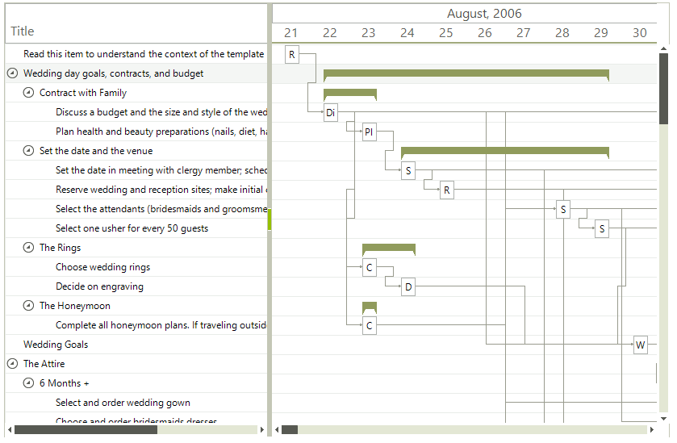

# WinForms GanttView Overview 

__RadGanttView__ is a data-visualization and editing control for project planning data and different types of task and time scheduling. All tasks are represented as vertical bars aligned along a timeline with the beginning and end time of each task determining its location along the timeline. These elements and the dependencies between them comprise the work breakdown structure of a project.




        

## Telerik UI for WinForms Learning Resources
* [Telerik UI for WinForms GanttView Homepage](https://www.telerik.com/products/winforms/ganttview.aspx)
* [Telerik UI for WinForms API Reference](https://docs.telerik.com/devtools/winforms/api/)
* [Getting Started with Telerik UI for WinForms Components]()
* [Telerik UI for WinForms Virtual Classroom (Training Courses for Registered Users)](https://learn.telerik.com/learn/course/external/view/elearning/17/TelerikUIforWinForms) 
* [Telerik UI for WinForms Forum](https://www.telerik.com/forums/winforms)
* [Telerik UI for WinForms Knowledge Base](https://docs.telerik.com/devtools/winforms/knowledge-base)

## See Also

* [Properties]()
