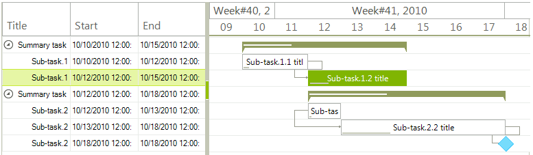
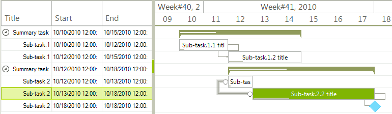

# Selection
 
**RadGanttView** provides you with selection functionality, which allows the user to select a link or a task displayed in the control. 

>caption Figure 1. Selected Task

>caption Figure 2. Selected Link

It is possible to select a task/link by simply clicking on the element with the mouse. The selection mechanism can be controlled programmatically as well. **RadGanttView** exposes the **SelectedItem** and **SelectedLink** properties which get or set the selected **GanttViewDataItem** and **GanttViewLinkDataItem** respectively. The **SelectedItemChanging** event is fired when the selected task is going to be changed. The **GanttViewSelectedItemChangingEventArgs** gives you access to the affected task. It is possible to prevent this selection by canceling the event. It is necessary to set the **Cancel** argument to *true*. The **SelectedItemChanged** event is fired once the task selected is completed. The **SelectedLinkChanging** and **SelectedLinkChanged** events follow a similar logic but for the links. 

# See Also

* [Properties]()
