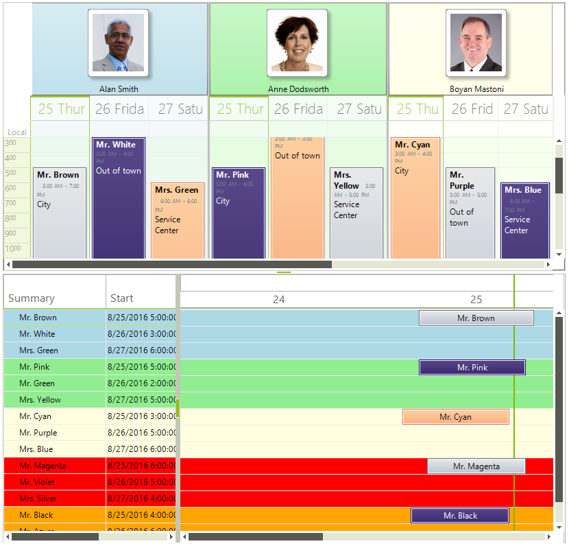

# Integration

This example will demonstrate how __RadGanttView__ integrates with __RadScheduler__, allowing you to show the appointments from __RadScheduler__ in __RadGanttView__. Editing any data in one control is immediately reflected in the other. The integration can be achieved with any control/component out there. The only condition is that the control/component implements the __IGanttViewDataProvider__ interface. Then you assign an instance of the type that implements the interface to the __DataProvider__ property of __RadGanttView__ and you are good to go.

## Integration with RadScheduler

In the case of __RadScheduler__ we have implemented a component (called __GanttViewIntegrationProvider__) which implements the interface and allows for two way notifications between the controls. Here is how to use it: 

{{source=..\SamplesCS\GanttView\SchedulerIntegration\SchedulerIntegration.cs region=Integration}} 
{{source=..\SamplesVB\GanttView\SchedulerIntegration\SchedulerIntegration.vb region=Integration}} 

````C#
this.radGanttView1.DataProvider = new GanttViewIntegrationProvider(this.radScheduler1);

````
````VB.NET
Me.radGanttView1.DataProvider = New GanttViewIntegrationProvider(Me.radScheduler1)

````

{{endregion}} 
 

Two things you need to note. The first is that __RadGanttView__ requires a unique id for each item in it. You can read more on how to provide such an "id" in the section on ["Adding new items"](). The other thing you need to be aware is the ids __RadScheduler__ assigns to its appointments. They are of type __EventId__ and need a `Guid` when constructed. Summing these two together gives the following code:   

{{source=..\SamplesCS\GanttView\SchedulerIntegration\SchedulerIntegration.cs region=TrickyPart}} 
{{source=..\SamplesVB\GanttView\SchedulerIntegration\SchedulerIntegration.vb region=TrickyPart}} 

````C#
private void radGanttView1_ItemChildIdNeeded(object sender, GanttViewItemChildIdNeededEventArgs e)
{
    e.ChildId = new EventId(Guid.NewGuid());
}

````
````VB.NET
Private Sub radGanttView1_ItemChildIdNeeded(sender As Object, e As Telerik.WinControls.UI.GanttViewItemChildIdNeededEventArgs) Handles radGanttView1.ItemChildIdNeeded
    e.ChildId = New EventId(Guid.NewGuid())
End Sub

````

{{endregion}} 



# See Also
* [RadScheduler]()