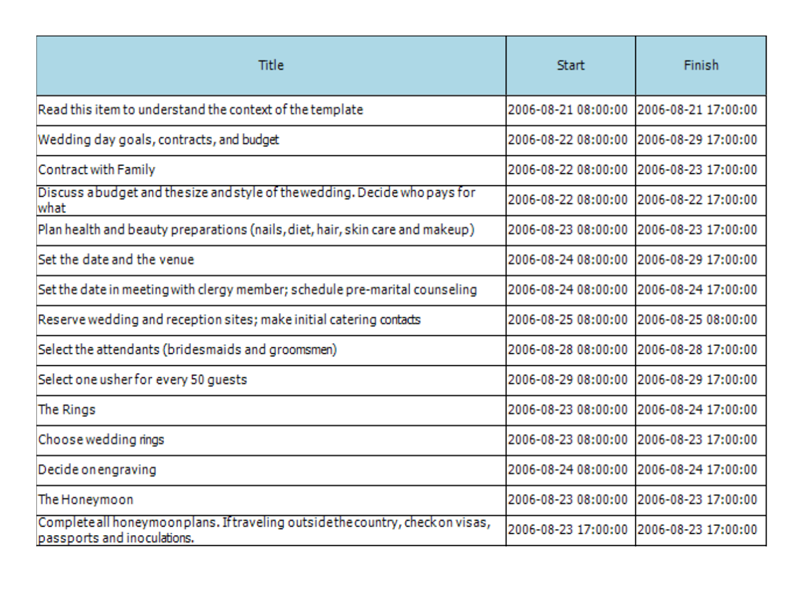
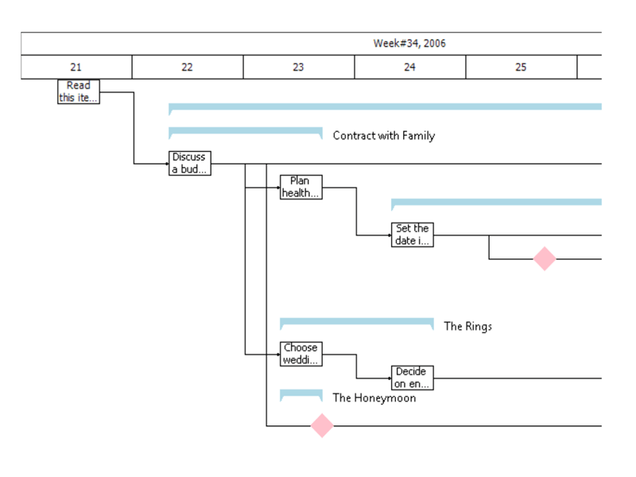
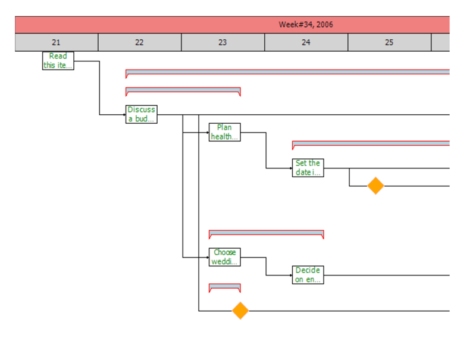

# Printing Events
 
You can customize the print output through the __PrintElementFormatting__ and __PrintElementPaint__ events. __PrintElementFormatting__ provides you with a print element which has style properties available so you can customize it as you see fit. The __PrintElementPaint__ gives you direct access to the graphical context and allows you to directly draw to the print output. 

## PrintElementFormatting

The following example demonstrates how you can use the __PrintContext__ property to determine what element is being printed and to change the styling accordingly. 

{{source=..\SamplesCS\GanttView\PrintingEvents\PrintingEvents.cs region=PrintFormatting}} 
{{source=..\SamplesVB\GanttView\PrintingEvents\PrintingEvents.vb region=PrintFormatting}} 

````C#
private void radGanttView1_PrintElementFormatting(object sender, GanttViewPrintElementFormattingEventArgs e)
{
    switch (e.PrintContext)
    {
        case GanttViewPrintElementContext.HeaderCell:
            e.PrintElement.BackColor = Color.LightBlue;
            break;
        case GanttViewPrintElementContext.DataCell:
            e.PrintElement.BorderColor = Color.Cyan;
            break;
        case GanttViewPrintElementContext.TaskElement:
            e.PrintElement.ForeColor = Color.Green;
            break;
        case GanttViewPrintElementContext.SummaryTaskElement:
            e.PrintElement.BorderColor = Color.Red;
            break;
        case GanttViewPrintElementContext.MilestoneElement:
            e.PrintElement.BackColor = Color.Orange;
            break;
        case GanttViewPrintElementContext.TimelineUpperElement:
            e.PrintElement.BackColor = Color.LightCoral;
            break;
        case GanttViewPrintElementContext.TimelineBottomElement:
            e.PrintElement.BackColor = Color.LightGray;
            break;
    }
}

````
````VB.NET
Private Sub GanttViewPrintElementFormattingEventArgs(sender As Object, e As GanttViewPrintElementFormattingEventArgs)
    Select Case e.PrintContext
        Case GanttViewPrintElementContext.HeaderCell
            e.PrintElement.BackColor = Color.LightBlue
            Exit Select
        Case GanttViewPrintElementContext.DataCell
            e.PrintElement.BorderColor = Color.Cyan
            Exit Select
        Case GanttViewPrintElementContext.TaskElement
            e.PrintElement.ForeColor = Color.Green
            Exit Select
        Case GanttViewPrintElementContext.SummaryTaskElement
            e.PrintElement.BorderColor = Color.Red
            Exit Select
        Case GanttViewPrintElementContext.MilestoneElement
            e.PrintElement.BackColor = Color.Orange
            Exit Select
        Case GanttViewPrintElementContext.TimelineUpperElement
            e.PrintElement.BackColor = Color.LightCoral
            Exit Select
        Case GanttViewPrintElementContext.TimelineBottomElement
            e.PrintElement.BackColor = Color.LightGray
            Exit Select
    End Select
End Sub

````

{{endregion}} 



## PrintElementPaint

This example demonstrates how you can paint the text of summary items next to the printed graphical representation.

{{source=..\SamplesCS\GanttView\PrintingEvents\PrintingEvents.cs region=PrintPaint}} 
{{source=..\SamplesVB\GanttView\PrintingEvents\PrintingEvents.vb region=PrintPaint}} 

````C#
private void radGanttView1_PrintElementPaint(object sender, GanttViewPrintElementPaintEventArgs e)
{
    if (e.PrintContext == GanttViewPrintElementContext.SummaryTaskElement)
    {
        GanttViewDataItem dataItem = e.DataContext as GanttViewDataItem;
        SizeF textSize = e.Graphics.MeasureString(dataItem.Title, this.radGanttView1.Font);
        RectangleF rect = new RectangleF(e.Rectangle.Right + 10, e.Rectangle.Y, textSize.Width, e.Rectangle.Height);
        e.Graphics.TextRenderingHint = System.Drawing.Text.TextRenderingHint.SingleBitPerPixelGridFit;
        e.Graphics.DrawString(dataItem.Title, this.radGanttView1.Font, Brushes.Black, rect);
    }
}

````
````VB.NET
Private Sub radGanttView1_PrintElementPaint(sender As Object, e As GanttViewPrintElementPaintEventArgs)
    If e.PrintContext = GanttViewPrintElementContext.SummaryTaskElement Then
        Dim dataItem As GanttViewDataItem = TryCast(e.DataContext, GanttViewDataItem)
        Dim textSize As SizeF = e.Graphics.MeasureString(dataItem.Title, Me.radGanttView1.Font)
        Dim rect As New RectangleF(e.Rectangle.Right + 10, e.Rectangle.Y, textSize.Width, e.Rectangle.Height)
        e.Graphics.TextRenderingHint = System.Drawing.Text.TextRenderingHint.SingleBitPerPixelGridFit
        e.Graphics.DrawString(dataItem.Title, Me.radGanttView1.Font, Brushes.Black, rect)
    End If
End Sub

````

{{endregion}} 



 