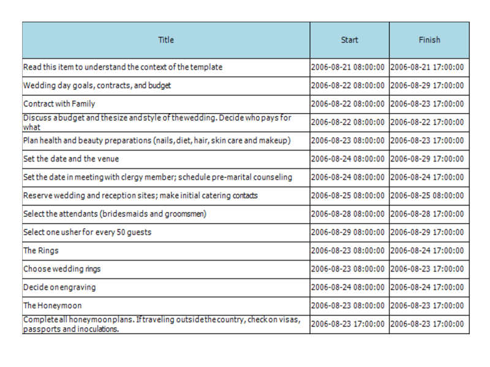
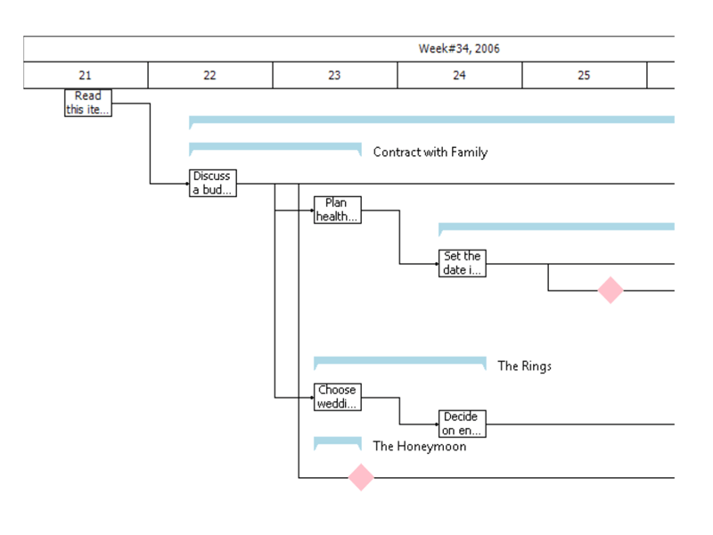
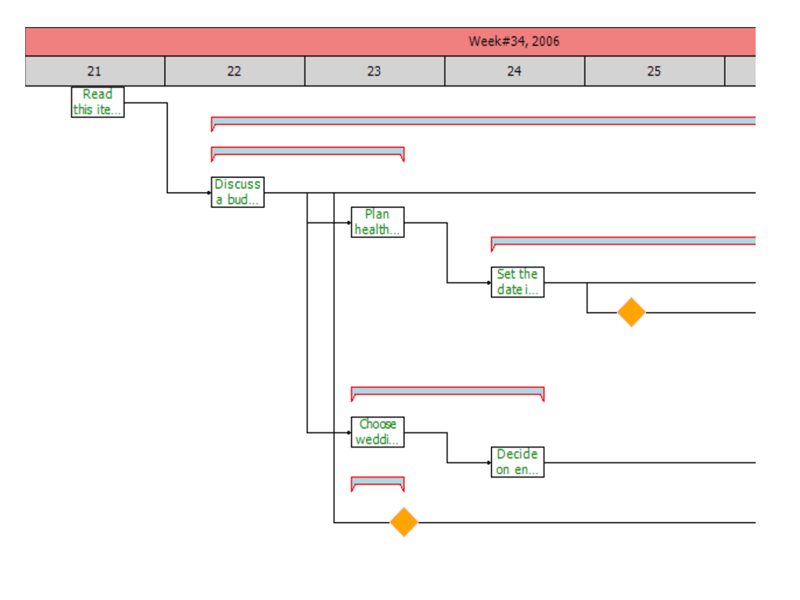

# Printing Events
 
You can customize the print output through the __PrintElementFormatting__ and __PrintElementPaint__ events. __PrintElementFormatting__ provides you with a print element which has style properties available so you can customize it as you see fit. The __PrintElementPaint__ gives you direct access to the graphical context and allows you to directly draw to the print output. 

## PrintElementFormatting

The following example demonstrates how you can use the __PrintContext__ property to determine what element is being printed and to change the styling accordingly. 

<snippet id='ganttview-printingevents-printformatting-cs' />
<snippet id='ganttview-printingevents-printformatting-vb' />

 

## PrintElementPaint

This example demonstrates how you can paint the text of summary items next to the printed graphical representation.

<snippet id='ganttview-printingevents-printpaint-cs' />
<snippet id='ganttview-printingevents-printpaint-vb' />

 

 
