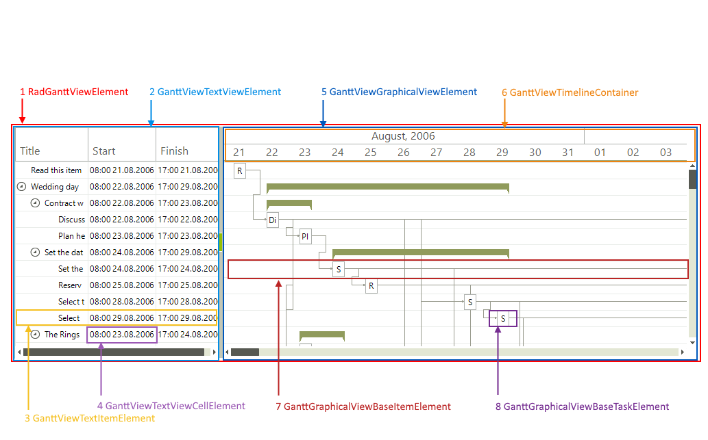

# Structure

The main elements of the structure of __RadGanttView__ are displayed below:
        
* RadGanttView
            
	* RadGanttViewElement

		* GanttViewTextViewElement (virtualized container)

			* GanttViewTextItemElement

				* GanttViewTextViewCellElement

		* GanttViewGraphicalViewElement (virtualized container)

			* GanttViewTimelineContainer (virtualized container)

			* GanttGraphicalViewBaseItemElement

				* GanttGraphicalViewBaseTaskElement
                            

1. RadGanttViewElement is the main element contained in the control. It parents the two main elements that you can see in RadGanttView and the separator between them.
            

1. __GanttViewTextViewElement__ is a virtualized stack container which holds the columns of the text view and the items in it.
            

1. __GanttViewTextItemElement__ represents a single row in the text view.
            

1. __GanttViewTextViewCellElement__ is a cell element which displays data from the data item.
            

1. __GanttViewGraphicalViewElement__ is a virtualized stack container which holds the timeline container, the items graphically visualizing the gantt data and the links connecting different tasks.
            

1. __GanttViewTimelineContainer__ is a virtualized stack container which holds items displaying time.
            

1. __GanttGraphicalViewBaseItemElement__ is the base type for the items displayed in the graphical view element
            

1. __GanttGraphicalViewBaseTaskElement__ is the base type for the task elements.
            
# See Also

* [Item types]()
