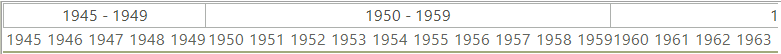

# Custom Timeline
 

__RadGanttView__ offers a number of built-in *TimeRange* settings which allow users to display the timeline in different views. Although these settings would cover most cases the users might require a view that is not available out-of-the-box. In this case developers can build their own timeline views. This article demonstrates the process for creating a custom timeline view which displays items in decades (10-year time spans). The following image demonstrates the final goal:

1\. First you need to set the __TimelineRange__ property of the gantt view graphical element to *Custom*. If you want you can override and modify the default views as well but for this example we will use the custom value. 

<snippet id='ganttview-decadestimeline-timerangecustom-cs' />
<snippet id='ganttview-decadestimeline-timerangecustom-vb' />

 

2\. Next you need to create a custom timeline behavior class and assign it to the graphical view. In this class you will add the logic for the new decades view. 

<snippet id='ganttview-decadestimeline-custombehavior-cs' />
<snippet id='ganttview-decadestimeline-custombehavior-vb' />

 
3\. Now you can fill the class with the code that will create the view. You should note that because we want to preserve the built-in views throughout the example we will check whether the time range is Custom and only handle this case.

* First you have to override the __AdjustedTimelineStart__ and __AdjustedTimelineEnd__ properties. What these properties do is to enlarge the timeline start and end to allow only whole timeline cells to be displayed. Here is an example. Imagine you use a view with quarters and your __TimelineStart__ property is set to 15.05.2013. This date is somewhere in the middle of the year’s second quarter. The __AdjustedTimelineStart__ property takes this date and the fact you use quarters and returns an adjusted date which is the actual start of the quarter. In this particular case the property will return 03.04.2013 which is the start date of the quarter that contains the __TimelineStart__ date. The __AdjustedTimelineEnd__ property does the same for the end of the timeline. For the decades view this properties will adjust the start and end dates to years: 

<snippet id='ganttview-decadestimeline-adjustedstartandend-cs' />
<snippet id='ganttview-decadestimeline-adjustedstartandend-vb' />

 

* Next you should override the __BuildTimelineDataItems__ method. The method returns a list of __GanttViewTimelineDataItems__. Each data item will represent a decade. 

<snippet id='ganttview-decadestimeline-ganttviewtimelinedataitems-cs' />
<snippet id='ganttview-decadestimeline-ganttviewtimelinedataitems-vb' />

 

* Next we have to calculate the timeline cells for each timeline data item. To this we override the __GetTimelineCellInfoForItem__ method. The method returns an instance of the __GanttTimelineCellsInfo__ struct. This struct contains two properties. The first one, __NumberOfcells__, indicates how many cells the given timeline data item will display. The second one, __StartIndex__, is useful in the case where you use repeatable cell items e.g. quarters, halves, thirds etc. The property is useful when the start of the timeline is not the first item in the repeatable values collection. Here is an example. Imagine the timeline starts is the third quarter of the year with this property you will later be able to set the proper text to the cell item. If you do not have this info your cells will always start at 0 or 1. Since in this example the start is the third quarter starting at 0 or 1 would be wrong. In our example we have continuous data so we will not use this property: 

<snippet id='ganttview-decadestimeline-gantttimelinecellsinfo-cs' />
<snippet id='ganttview-decadestimeline-gantttimelinecellsinfo-vb' />

 
* Finally we want to have a proper text inside our decade timeline items. For this purpose we override the __GetTimelineTopElementText__ and __GetTimelineBottomElementText__ methods.
                 
<snippet id='ganttview-decadestimeline-timelineelementstext-cs' />
<snippet id='ganttview-decadestimeline-timelineelementstext-vb' />

# See Also

* [Timeline views]()
* [Working Hours in GanttView]()

