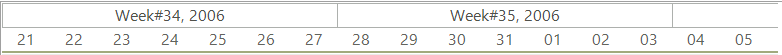
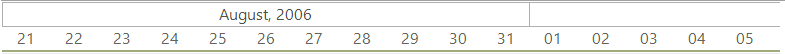
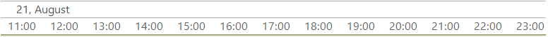
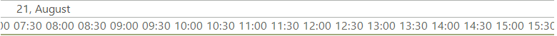
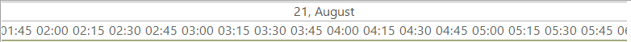
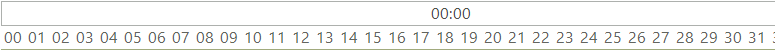

# Timeline views

__RadGanttView__ offers a number of built-in timeline views which allow you to show the timeline in different scales. It is reasonable to change the timeline view when the user zooms in or out. This will give the users a precise measurement of time in every zoom level. 

All built-in views can be found in the *TimeRange* enumeration. Here are the different views offered by __RadGanttView__ out-of-the-box:

>important The RadGanttView.GanttViewElement.**GraphicalViewElement** exposes the **OnePixelTime** property. This property determines how much time a single pixel represents. The time line views vary from years to quarter hours and depending on the chosen view one needs to set an appropriate **OnePixelTime**.

* __TimeRange.Week__ : Each element of the upper row represents one week. The elements on the lower row represent days.

{{source=..\SamplesCS\GanttView\TimelineViews\GanttTimelineViews.cs region=TimeRangeWeek}} 
{{source=..\SamplesVB\GanttView\TimelineViews\GanttTimelineViews.vb region=TimeRangeWeek}} 

````C#
this.radGanttView1.GanttViewElement.GraphicalViewElement.TimelineRange = TimeRange.Week;

````
````VB.NET
Me.RadGanttView1.GanttViewElement.GraphicalViewElement.TimelineRange = TimeRange.Week

````

{{endregion}} 



* __TimeRange.Month:__  Each element of the upper row represents one month. The elements on the lower row represent days. 

{{source=..\SamplesCS\GanttView\TimelineViews\GanttTimelineViews.cs region=TimeRangeMonth}} 
{{source=..\SamplesVB\GanttView\TimelineViews\GanttTimelineViews.vb region=TimeRangeMonth}} 

````C#
this.radGanttView1.GanttViewElement.GraphicalViewElement.TimelineRange = TimeRange.Month;

````
````VB.NET
Me.RadGanttView1.GanttViewElement.GraphicalViewElement.TimelineRange = TimeRange.Month

````

{{endregion}} 



* __TimeRange.Year:__ Each element of the upper row represents one year. The elements on the lower row represent months.

{{source=..\SamplesCS\GanttView\TimelineViews\GanttTimelineViews.cs region=TimeRangeYear}} 
{{source=..\SamplesVB\GanttView\TimelineViews\GanttTimelineViews.vb region=TimeRangeYear}} 

````C#
this.radGanttView1.GanttViewElement.GraphicalViewElement.TimelineRange = TimeRange.Year;

````
````VB.NET
Me.radGanttView1.GanttViewElement.GraphicalViewElement.TimelineRange = TimeRange.Year

````

{{endregion}} 


* __TimeRange.YearHalves:__ Each element of the upper row represents one year. The elements on the lower row represent half year periods (roughly six months). 

{{source=..\SamplesCS\GanttView\TimelineViews\GanttTimelineViews.cs region=TimeRangeYearHalves}} 
{{source=..\SamplesVB\GanttView\TimelineViews\GanttTimelineViews.vb region=TimeRangeYearHalves}} 

````C#
this.radGanttView1.GanttViewElement.GraphicalViewElement.TimelineRange = TimeRange.YearHalves;

````
````VB.NET
Me.radGanttView1.GanttViewElement.GraphicalViewElement.TimelineRange = TimeRange.YearHalves

````

{{endregion}} 


* __TimeRange.YearQuarters:__ Each element of the upper row represents one year. The elements on the lower row represent quarter year periods (roughly three months).
             

{{source=..\SamplesCS\GanttView\TimelineViews\GanttTimelineViews.cs region=TimeRangeYearQuarters}} 
{{source=..\SamplesVB\GanttView\TimelineViews\GanttTimelineViews.vb region=TimeRangeYearQuarters}} 

````C#
this.radGanttView1.GanttViewElement.GraphicalViewElement.TimelineRange = TimeRange.YearQuarters;

````
````VB.NET
Me.radGanttView1.GanttViewElement.GraphicalViewElement.TimelineRange = TimeRange.YearQuarters

````

{{endregion}} 


* __TimeRange.Day__ – Each element of the upper row represents one day. The elements on the lower row represent hours. 

{{source=..\SamplesCS\GanttView\TimelineViews\GanttTimelineViews.cs region=TimeRangeDay}} 
{{source=..\SamplesVB\GanttView\TimelineViews\GanttTimelineViews.vb region=TimeRangeDay}} 

````C#
this.radGanttView1.GanttViewElement.GraphicalViewElement.TimelineRange = TimeRange.Day;

````
````VB.NET
Me.radGanttView1.GanttViewElement.GraphicalViewElement.TimelineRange = TimeRange.Day

````

{{endregion}} 




* __TimeRange.DayHalfHours:__ Each element of the upper row represents one day. The elements on the lower row represent half hours (30 minutes period).
             
{{source=..\SamplesCS\GanttView\TimelineViews\GanttTimelineViews.cs region=TimeRangeDayHalfHours}} 
{{source=..\SamplesVB\GanttView\TimelineViews\GanttTimelineViews.vb region=TimeRangeDayHalfHours}} 

````C#
this.radGanttView1.GanttViewElement.GraphicalViewElement.TimelineRange = TimeRange.DayHalfHours;

````
````VB.NET
Me.radGanttView1.GanttViewElement.GraphicalViewElement.TimelineRange = TimeRange.DayHalfHours

````

{{endregion}} 




* __TimeRange.DayQuarterHours:__ Each element of the upper row represents one day. The elements on the lower row represent quarter hours (15 minutes period).
            

{{source=..\SamplesCS\GanttView\TimelineViews\GanttTimelineViews.cs region=TimeRangeDayQuarterHours}} 
{{source=..\SamplesVB\GanttView\TimelineViews\GanttTimelineViews.vb region=TimeRangeDayQuarterHours}} 

````C#
this.radGanttView1.GanttViewElement.GraphicalViewElement.TimelineRange = TimeRange.DayQuarterHours;

````
````VB.NET
Me.radGanttView1.GanttViewElement.GraphicalViewElement.TimelineRange = TimeRange.DayQuarterHours

````

{{endregion}} 




* __TimeRange.Hour:__ Each element of the upper row represents one hour. The elements on the lower row represent minutes. 

{{source=..\SamplesCS\GanttView\TimelineViews\GanttTimelineViews.cs region=TimeRangeHour}} 
{{source=..\SamplesVB\GanttView\TimelineViews\GanttTimelineViews.vb region=TimeRangeHour}} 

````C#
this.radGanttView1.GanttViewElement.GraphicalViewElement.TimelineRange = TimeRange.Hour;

````
````VB.NET
Me.radGanttView1.GanttViewElement.GraphicalViewElement.TimelineRange = TimeRange.Hour

````

{{endregion}} 




# See Also

* [Zoom to Date Range]()
* [Custom Timeline]()