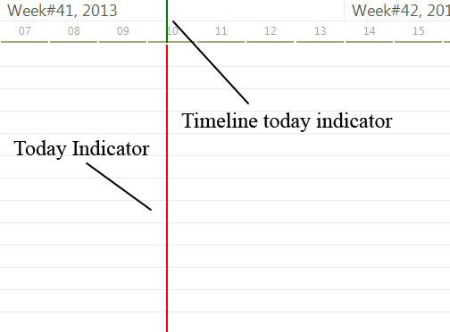

# Today Indicator
 
The today indicator represents the current date and time in the graphical view of __RadGanttView__. There are two indicators you can show. One is positioned over the timeline and the other is directly over the graphical view. 

You can control which one is visible through the __ShowTodayIndicator__ and the __ShowTimelineTodayIndicator__ properties.

You can also directly access the two indicators: 

<snippet id='ganttview-todayindicator-indicatorsaccess-cs' />
<snippet id='ganttview-todayindicator-indicatorsaccess-vb' />

 

# See Also

* [Properties]()
