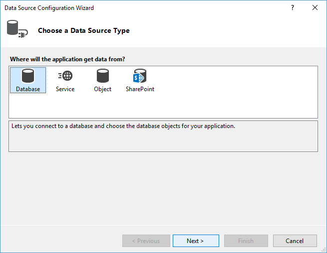
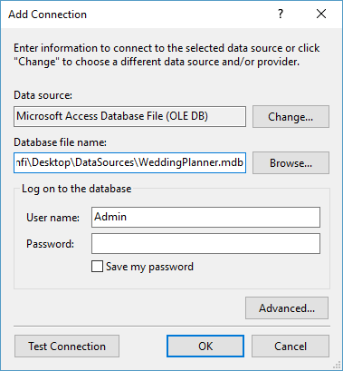
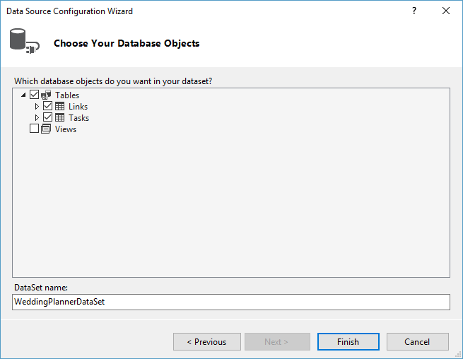
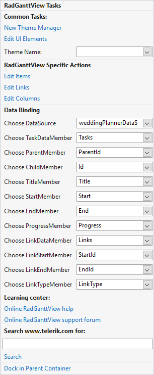
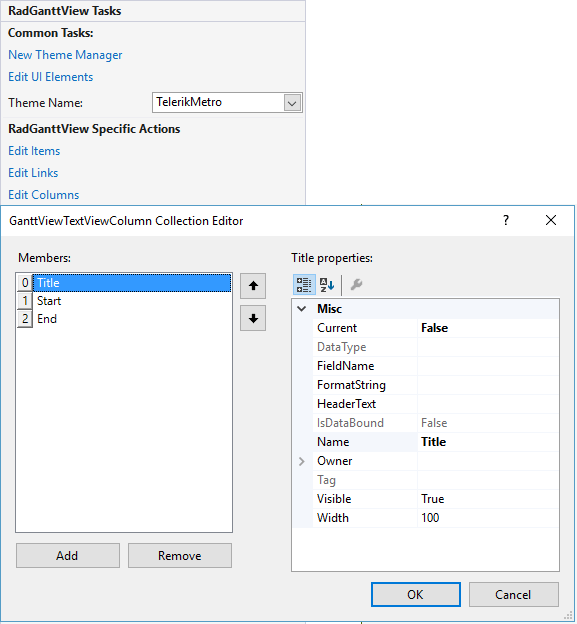
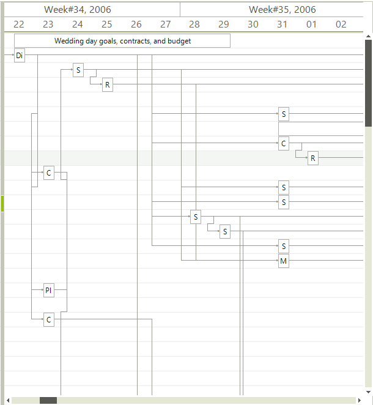

# Binding to database

__RadGanttView__ supports binding to Database data. Levels are created using the __Parent__ and __Child__ members' values. You can read more on the data binding properties of RadGanttView in the [binding basics article.]()

1. In a new Windows project drop a __RadGanttView__ control on the form.

1. In the __DataSource__ property drop down in the `Properties` window of from the Smart Tag of the control select the __Add Project Data Source__ link.
            

1. In the __Choose a Data Source Type__ page select the __Database__ icon, then click the __Next__ button.
            
	

1. In the __Choose Your Data Connection__ page of the wizard click the __New Connection__ button.
            

1. In the __Add Connection__ dialog click __Change__, select "Microsoft Access Database File" and click __OK__. In the __Database file name__ entry click __Browse__ and locate the `WeddingPlanner.mdb` file.  Click __OK__. When prompted if you would like to copy the local data file to your project click __Yes__.

    >note You can download the mdb file from here: [WeddingPlanner.mdb](http://www.telerik.com/docs/default-source/ui-for-winforms/weddingplanner.zip?sfvrsn=2)
    

	

1. In the `Choose Your Database Objects` page of the wizard check the "Tasks" and "Links" tables checkboxes. Click __Finish__.
            
	

1. Set the __DataSource__ property first to _Tasks_, then to _Links_ datatable. This will create the necessary data-binding components in the component tray - a `DataSet`, `BindingSources` and `TableAdapters`. The `DataSet` is the container for the data, the `TableAdapters` are used to fill the `DataSet`.
            

1. In the Smart Tag or in the properties window set the member properties in the following way.
            
	

1. Once the binding is completed, you can open the _Edit Columns_ option from the Smart Tag, where you can add three columns. Make sure to set their FieldName's to the respective fields - Title, Start and End.

	

1. Finally add this code to the form load event handler to specify the timeline range:
            
{{source=..\SamplesCS\GanttView\WorkingWithData\BindingToDatabase.cs region=BindingToDatabase}} 
{{source=..\SamplesVB\GanttView\WorkingWithData\BindingToDatabase.vb region=BindingToDatabase}} 

````C#
this.radGanttView1.GanttViewElement.GraphicalViewElement.TimelineStart = new DateTime(2006, 8, 2);
this.radGanttView1.GanttViewElement.GraphicalViewElement.TimelineEnd = new DateTime(2007, 4, 2);

````
````VB.NET
Me.radGanttView1.GanttViewElement.GraphicalViewElement.TimelineStart = New DateTime(2006, 8, 2)
Me.radGanttView1.GanttViewElement.GraphicalViewElement.TimelineEnd = New DateTime(2007, 4, 2)

````

{{endregion}} 



# See Also  

* [Adding new items]()
* [Data Binding Basics]()
* [Importing XML from MS Project]()
* [Link Type Converter]()
* [Populating with Data Programmatically]()
