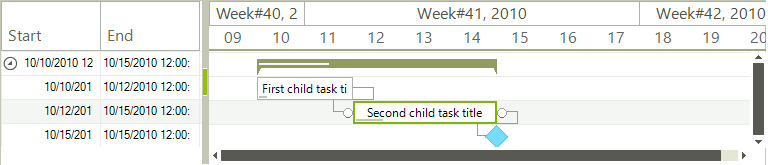

# Data binding basics

__RadGanttView__ binds to any object that implements `IList`, `IListSource` or `IBindingList`. This includes generic lists and `BindingSource` for example. To make data binding work, minimally you must assign the __DataSource__ property and the member properties explained below.
        
* __TaskDataMember:__ Set this to the filed that holds the collection of data that will be used to populate the tasks.


* __ChildMember*:__  Set this to the name of the field that will be used as Id of each record.
        

* __ParentMember*:__ Set this to the name of the field that will be used to build the hierarchy of tasks.
        

* __TitleMember*:__ Set this to the name of the filed that will be used as title for the tasks.
        

* __StartMember*:__ Set this to the name of the field that will be used as start for the tasks.
        

* __EndMember*:__ Set this to the name of the field that will be used as end for the tasks.
        

* __ProgressMember:__ Set this to the name of the field that will be used as progress of the tasks
        

* __LinkDataMember:__ Set this to the field name that holds the collection of data that will be used to populate the links.
        

* __LinkStartMember**:__ Set this to the name of the field that will be used as id for the start item of a link.
        

* __LinkEndMember**__ Set this to the name of the field that will be used as id for the end item of a link.
        

* __LinkTypeMember **__ Set this to the name of the field that will be used to define the type of a link.
        

>note \* - Marks the members that are the bare minimum to show a gantt with tasks.
>** - Marks the members that are required to show links.

The following example demonstrates a sample data with all the code needed to bind and show this data in __RadGanttView__:

1\. First we define the schema of the data.
            
{{source=..\SamplesCS\GanttView\WorkingWithData\DataBindingBasics.cs region=DataSchema}} 
{{source=..\SamplesVB\GanttView\WorkingWithData\DataBindingBasics.vb region=DataSchema}} 

````C#
DataTable tasks = new DataTable("Tasks");
tasks.Columns.Add("Id", typeof(int));
tasks.Columns.Add("ParentId", typeof(int));
tasks.Columns.Add("Title", typeof(string));
tasks.Columns.Add("Start", typeof(DateTime));
tasks.Columns.Add("End", typeof(DateTime));
tasks.Columns.Add("Progress", typeof(decimal));
DataTable links = new DataTable("Links");
links.Columns.Add("StartId", typeof(int));
links.Columns.Add("EndId", typeof(int));
links.Columns.Add("LinkType", typeof(int));
DataSet data = new DataSet();
data.Tables.Add(tasks);
data.Tables.Add(links);

````
````VB.NET
Dim tasks As New DataTable("Tasks")
tasks.Columns.Add("Id", GetType(Integer))
tasks.Columns.Add("ParentId", GetType(Integer))
tasks.Columns.Add("Title", GetType(String))
tasks.Columns.Add("Start", GetType(DateTime))
tasks.Columns.Add("End", GetType(DateTime))
tasks.Columns.Add("Progress", GetType(Decimal))
Dim links As New DataTable("Links")
links.Columns.Add("StartId", GetType(Integer))
links.Columns.Add("EndId", GetType(Integer))
links.Columns.Add("LinkType", GetType(Integer))
Dim data As New DataSet()
data.Tables.Add(tasks)
data.Tables.Add(links)

````

{{endregion}} 
 

2\. USe the following snippet to populate with data.
 
{{source=..\SamplesCS\GanttView\WorkingWithData\DataBindingBasics.cs region=SampleData}} 
{{source=..\SamplesVB\GanttView\WorkingWithData\DataBindingBasics.vb region=SampleData}} 

````C#
tasks.Rows.Add(1, 0, "Summary task title", new DateTime(2010, 10, 10), new DateTime(2010, 10, 15), 30m);
tasks.Rows.Add(2, 1, "First child task title", new DateTime(2010, 10, 10), new DateTime(2010, 10, 12), 10);
tasks.Rows.Add(3, 1, "Second child task title", new DateTime(2010, 10, 12), new DateTime(2010, 10, 15), 20m);
tasks.Rows.Add(4, 1, "Milestone", new DateTime(2010, 10, 15), new DateTime(2010, 10, 15), 0m);
links.Rows.Add(2, 3, 1);
links.Rows.Add(3, 4, 1);

````
````VB.NET
tasks.Rows.Add(1, 0, "Summary task title", New DateTime(2010, 10, 10), New DateTime(2010, 10, 15), 30D)
tasks.Rows.Add(2, 1, "First child task title", New DateTime(2010, 10, 10), New DateTime(2010, 10, 12), 10)
tasks.Rows.Add(3, 1, "Second child task title", New DateTime(2010, 10, 12), New DateTime(2010, 10, 15), 20D)
tasks.Rows.Add(4, 1, "Milestone", New DateTime(2010, 10, 15), New DateTime(2010, 10, 15), 0D)
links.Rows.Add(2, 3, 1)
links.Rows.Add(3, 4, 1)

````

{{endregion}} 
 
3\. Set all the aforementioned properties.
           
{{source=..\SamplesCS\GanttView\WorkingWithData\DataBindingBasics.cs region=SetupAndBinding}} 
{{source=..\SamplesVB\GanttView\WorkingWithData\DataBindingBasics.vb region=SetupAndBinding}} 

````C#
this.radGanttView1.GanttViewElement.TaskDataMember = "Tasks";
this.radGanttView1.GanttViewElement.ChildMember = "Id";
this.radGanttView1.GanttViewElement.ParentMember = "ParentId";
this.radGanttView1.GanttViewElement.TitleMember = "Title";
this.radGanttView1.GanttViewElement.StartMember = "Start";
this.radGanttView1.GanttViewElement.EndMember = "End";
this.radGanttView1.GanttViewElement.ProgressMember = "Progress";
this.radGanttView1.GanttViewElement.LinkDataMember = "Links";
this.radGanttView1.GanttViewElement.LinkStartMember = "StartId";
this.radGanttView1.GanttViewElement.LinkEndMember = "EndId";
this.radGanttView1.GanttViewElement.LinkTypeMember = "LinkType";
this.radGanttView1.GanttViewElement.DataSource = data;
this.radGanttView1.Columns.Add("Start");
this.radGanttView1.Columns.Add("End");

````
````VB.NET
Me.RadGanttView1.GanttViewElement.TaskDataMember = "Tasks"
Me.RadGanttView1.GanttViewElement.ChildMember = "Id"
Me.RadGanttView1.GanttViewElement.ParentMember = "ParentId"
Me.RadGanttView1.GanttViewElement.TitleMember = "Title"
Me.RadGanttView1.GanttViewElement.StartMember = "Start"
Me.RadGanttView1.GanttViewElement.EndMember = "End"
Me.RadGanttView1.GanttViewElement.ProgressMember = "Progress"
Me.RadGanttView1.GanttViewElement.LinkDataMember = "Links"
Me.RadGanttView1.GanttViewElement.LinkStartMember = "StartId"
Me.RadGanttView1.GanttViewElement.LinkEndMember = "EndId"
Me.RadGanttView1.GanttViewElement.LinkTypeMember = "LinkType"
Me.RadGanttView1.GanttViewElement.DataSource = data
Me.RadGanttView1.Columns.Add("Start")
Me.RadGanttView1.Columns.Add("End")

````

{{endregion}} 

>important If you don't see the tasks, it is most probably because the graphical view is not scrolled to the tasks' date. Feel free to set the **TimelineStart** and **TimelineEnd** properties of the GanttViewElement.**GraphicalViewElement**.



# See Also  

* [Binding to Database]()
* [Adding new items]()
* [Importing XML from MS Project]()
* [Link Type Converter]()
* [Populating with Data Programmatically]()
