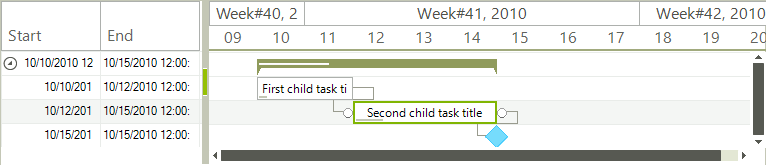

# Data Binding Basics

__RadGanttView__ binds to any object that implements `IList`, `IListSource` or `IBindingList`. This includes generic lists and `BindingSource` for example. To make data binding work, minimally you must assign the __DataSource__ property and the member properties explained below.
        
* __TaskDataMember:__ Set this to the filed that holds the collection of data that will be used to populate the tasks.

* __ChildMember*:__  Set this to the name of the field that will be used as Id of each record.
        

* __ParentMember*:__ Set this to the name of the field that will be used to build the hierarchy of tasks.
        

* __TitleMember*:__ Set this to the name of the filed that will be used as title for the tasks.
        

* __StartMember*:__ Set this to the name of the field that will be used as start for the tasks.
        

* __EndMember*:__ Set this to the name of the field that will be used as end for the tasks.
        

* __ProgressMember:__ Set this to the name of the field that will be used as progress of the tasks
        

* __LinkDataMember:__ Set this to the field name that holds the collection of data that will be used to populate the links.
        

* __LinkStartMember**:__ Set this to the name of the field that will be used as id for the start item of a link.
        

* __LinkEndMember**__ Set this to the name of the field that will be used as id for the end item of a link.
        

* __LinkTypeMember **__ Set this to the name of the field that will be used to define the type of a link.
        

>note \* - Marks the members that are the bare minimum to show a gantt with tasks.
>** - Marks the members that are required to show links.

The following example demonstrates a sample data with all the code needed to bind and show this data in __RadGanttView__:

1\. First we define the schema of the data.
            
<snippet id='ganttview-databindingbasics-dataschema-cs' />
<snippet id='ganttview-databindingbasics-dataschema-vb' />

 

2\. USe the following snippet to populate with data.
 
<snippet id='ganttview-databindingbasics-sampledata-cs' />
<snippet id='ganttview-databindingbasics-sampledata-vb' />

 
3\. Set all the aforementioned properties.
           
<snippet id='ganttview-databindingbasics-setupandbinding-cs' />
<snippet id='ganttview-databindingbasics-setupandbinding-vb' />

>important If you don't see the tasks, it is most probably because the graphical view is not scrolled to the tasks' date. Feel free to set the **TimelineStart** and **TimelineEnd** properties of the GanttViewElement.**GraphicalViewElement**.

# See Also  

* [Binding to Database]()
* [Adding new items]()
* [Importing XML from MS Project]()
* [Link Type Converter]()
* [Populating with Data Programmatically]()
