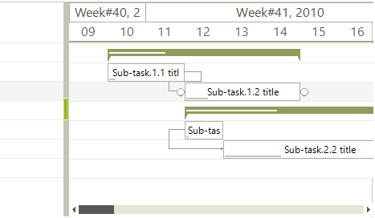
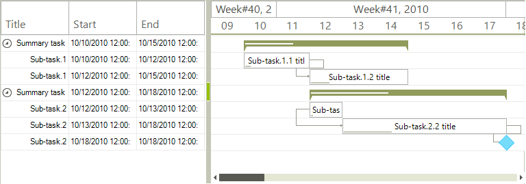

# Populating with Data Programmatically

__RadGanttview__ supports unbound mode as well, which means that you can manually populate it with the summary items, task items and milestone items (if needed). Then just set up the links between tasks and you have your gantt setup. The following example starts by setting the desired start and end range of the graphical element and then we are adding a few task items with sub items. At the end we are adding the links between the items.
        

<snippet id='ganttview-populatingwithdataprogrammatically-populatedata-cs' />
<snippet id='ganttview-populatingwithdataprogrammatically-populatedata-vb' />

Now we can just add the desired columns to be displayed in __GanttViewTextViewElement__. During the column initialization we will pass a string to specify the __FieldName__ so the column will know which fields of the tasks to display. In addition this string will also be used as header text.

<snippet id='ganttview-populatingwithdataprogrammatically-addcolumns-cs' />
<snippet id='ganttview-populatingwithdataprogrammatically-addcolumns-vb' />

# See Also  

* [Binding to Database]()
* [Data Binding Basics]()
* [Importing XML from MS Project]()
* [Link Type Converter]()
* [Adding new items]()
