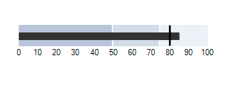

# Overview

The __RadBulletGraph__ control is a variation of linear gauge. It combines a number of indicators into one control making it light-weight, customizable, and straightforward to setup and use. The control is a great tool for dashboards as it is the optimal way to present a lot of information in relatively small size.

>caption Figure 1: RadBulletGraph

## Key Features

* __Easy to use__: Using Telerik __RadBulletGraph__ is as easy as just dragging and dropping it from the toolbox.

* The Telerik __RadBulletGraph__ control supports the full design specification: non zero-based scale, negative featured measures, projected values, having many comparative measures and quantitative ranges is not a problem.

* __Data Binding Support__: The control can be easily data bound to your business data, either by setting its properties directly, or by using a binding declaration.

# See Also

* [Structure]()
* [Getting Started]()
* [Smart Tag]()