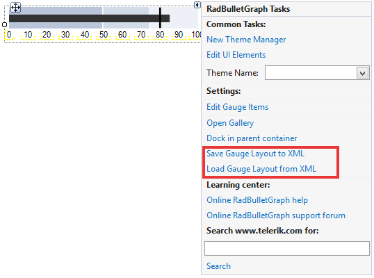

# Save and Load Layout

__RadBulletGraph__ supports Save/Load layout functionality which gives you the opportunity to preserve gauge elements' settings and restore them later. The layout settings are written in xml file. You can save the layout at design or at run time.

## Design Time

You can easily save/load the layout with the smart tag.

>caption Figure 1: Smart Tag

## Run Time

You can save/load the layout in code as well. 

#### Save/Load Layout

<snippet id='gauges-bulletgraphcode-saveloadlayout-cs' />
<snippet id='gauges-bulletgraphcode-saveloadlayout-vb' />

# See Also

* [Design Time]()
* [Getting Started]()

