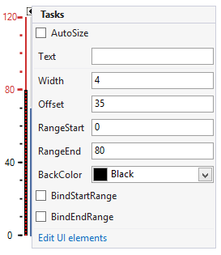

# Working with Line

This element represents a single line which can be used with the ticks.

## Design Time

The following image shows the smart tag of the gauge control when the line is selected. You can change the line properties directly in the smart tag window.

>caption Figure 1: Design Time

## Properties

* __RangeStart:__ Indicates the start value of the bar.
            

* __RangeEnd:__ Indicates the end value of the bar.
            

* __Width:__ Indicates the width of the line.
            

* __Offset:__ Specifies how far to the left/bottom the element will be shifted.
            

* __BackColor:__ This property allows you to specify the color of the line.
            

* __BindStartRange__, __BindEndRange:__ These properties allow you to bind the start/end ranges of the line to the ones of the gauge.      

# See Also

* [Structure]()
* [Design Time]()
* [Properties and Events]()