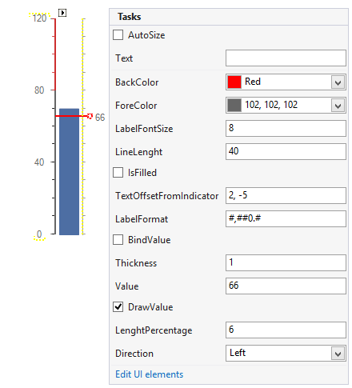

# Working with Needle Indicator

__LinearGaugeNeedleIndicator__ is a scale indicator that points to a value.

## Design Time

The following image shows the smart tag of the gauge control when the needle is selected. You can change the line properties directly in the smart tag window.

>caption Figure 1: Design Time

## Properties

* __Value:__ Specifies the needle’s value.

* __BackColor:__ Specifies the color of the needle.

* __ForeColor:__ Controls the label color.

* __LabelFontSize:__ Specifies the labels font size.

* __LineLength:__ Specifies the length of the needle’s line.

* __IsFilled:__ Specifies if the needle figure should be filled.

* __TextOffsetFromIndicator:__ Specifies the label offset.

* __LabelFormat:__ Allows you to set the format of the label.

* __BindValue:__ Controls if the needle value is bound to the gauge value.

* __Thickness:__ Controls how thick the needle will be rendered.

* __DrawValue:__ Specifies if the label should be drawn.

* __LengthPerecentage:__ Controls the length of the entire needle. The element is sized according to its center which means that if the value of this property is set to 50 the needle length will equal the control width or height.

* __Direction:__ Specifies the needles direction.

* __CircleTicks:__ If set to true the indicator figure will be a circle otherwise it will be a triangle.

# See Also

* [Structure]()
* [Design Time]()
* [Properties and Events]()