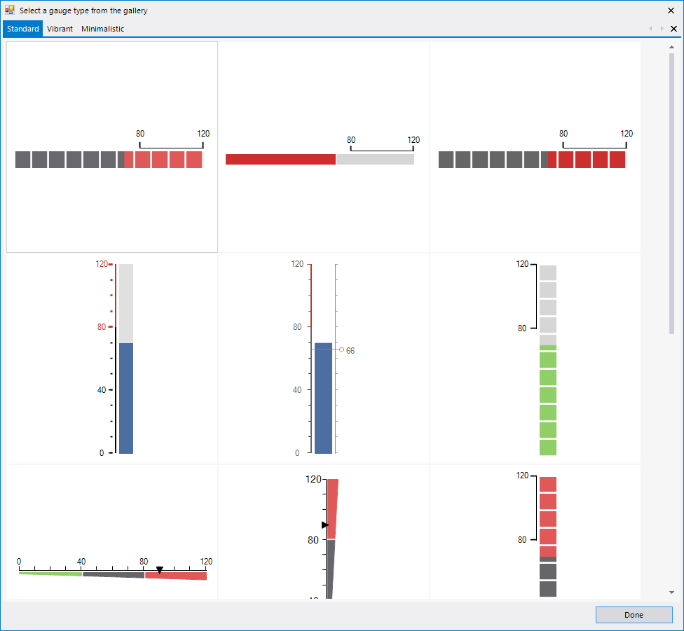
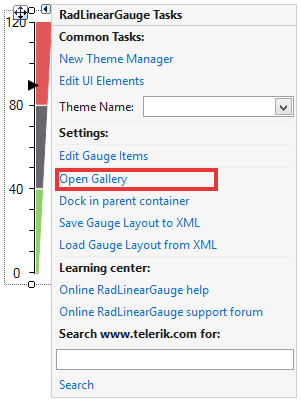
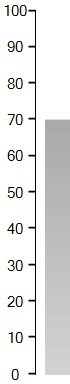

# Getting Started with WinForms LinearGauge

This article shows how you can add the control at design time or with code

## Design Time

When you drag a __RadLinearGauge__ from the Toolbox and then drop it on the form, the gauge gallery will offer you to pick up the desired type:

>caption Figure 1: Gallery Types


>note If you do not choose a gauge's style and just close the gallery, an empty __RadRadialGauge__ will be created.
>

You can open the gallery from the smart tag as well.
       
>caption Figure 2: Smart Tag Gallery Option 


## Adding Items Programmatically

This example demonstrates how to programmatically setup a linear gauge.

>caption Figure 3: Programmatically Added Items


#### Add Items

{{source=..\SamplesCS\Gauges\LinearGauge\LinearGuageGettingStarted.cs region=add}} 
{{source=..\SamplesVB\Gauges\LinearGauge\LinearGuageGettingStarted.vb region=add}} 

````C#
RadLinearGauge radLinearGauge1 = new RadLinearGauge();
radLinearGauge1.Location = new Point(20, 20);
radLinearGauge1.Padding = new System.Windows.Forms.Padding(0, 10, 0, 10);
radLinearGauge1.RangeEnd = 100F;
radLinearGauge1.Size = new System.Drawing.Size(70, 384);
radLinearGauge1.Value = 70F;
radLinearGauge1.BackColor = Color.White;
radLinearGauge1.Vertical = true;
this.Controls.Add(radLinearGauge1);
LinearGaugeBar linearGaugeBar1 = new LinearGaugeBar();
linearGaugeBar1.BackColor = Color.DarkGray;
linearGaugeBar1.BackColor2 = Color.LightGray;
linearGaugeBar1.BindEndRange = true;
linearGaugeBar1.Offset = 35F;
linearGaugeBar1.RangeEnd = 100F;
LinearGaugeLine linearGaugeLine1 = new LinearGaugeLine();
linearGaugeLine1.AutoSize = false;
linearGaugeLine1.Bounds = new System.Drawing.Rectangle(0, 0, 60, 384);
linearGaugeLine1.Offset = 35F;
linearGaugeLine1.Padding = new System.Windows.Forms.Padding(0);
linearGaugeLine1.RangeEnd = 100F;
linearGaugeLine1.Width = 1F;
LinearGaugeTicks linearGaugeTicks1 = new LinearGaugeTicks();
linearGaugeTicks1.Padding = new System.Windows.Forms.Padding(0);
linearGaugeTicks1.TicksCount = 10;
linearGaugeTicks1.TicksLenghtPercentage = 10F;
linearGaugeTicks1.TicksLocationPercentage = 35F;
linearGaugeTicks1.TickThickness = 0.5F;
LinearGaugeLabels linearGaugeLabels1 = new LinearGaugeLabels();
linearGaugeLabels1.LabelFontSize = 3F;
linearGaugeLabels1.LabelLocationPercentage = 15F;
linearGaugeLabels1.LabelsCount = 10;
linearGaugeLabels1.LabelStartVisibleRange = 0F;
radLinearGauge1.Items.Add(linearGaugeBar1);
radLinearGauge1.Items.Add(linearGaugeLine1);
radLinearGauge1.Items.Add(linearGaugeTicks1);
radLinearGauge1.Items.Add(linearGaugeLabels1);

````
````VB.NET
Dim radLinearGauge1 As New RadLinearGauge()
radLinearGauge1.Location = New System.Drawing.Point(20, 20)
radLinearGauge1.Padding = New System.Windows.Forms.Padding(0, 10, 0, 10)
radLinearGauge1.RangeEnd = 100.0F
radLinearGauge1.Size = New System.Drawing.Size(70, 384)
radLinearGauge1.Value = 70.0F
radLinearGauge1.BackColor = Color.White
radLinearGauge1.Vertical = True
Me.Controls.Add(radLinearGauge1)
Dim linearGaugeBar1 As New LinearGaugeBar()
linearGaugeBar1.BackColor = Color.DarkGray
linearGaugeBar1.BackColor2 = Color.LightGray
linearGaugeBar1.BindEndRange = True
linearGaugeBar1.Offset = 35.0F
linearGaugeBar1.RangeEnd = 100.0F
Dim linearGaugeLine1 As New LinearGaugeLine()
linearGaugeLine1.AutoSize = False
linearGaugeLine1.Bounds = New System.Drawing.Rectangle(0, 0, 60, 384)
linearGaugeLine1.Offset = 35.0F
linearGaugeLine1.Padding = New System.Windows.Forms.Padding(0)
linearGaugeLine1.RangeEnd = 100.0F
linearGaugeLine1.Width = 1.0F
Dim linearGaugeTicks1 As New LinearGaugeTicks()
linearGaugeTicks1.Padding = New System.Windows.Forms.Padding(0)
linearGaugeTicks1.TicksCount = 10
linearGaugeTicks1.TicksLenghtPercentage = 10.0F
linearGaugeTicks1.TicksLocationPercentage = 35.0F
linearGaugeTicks1.TickThickness = 0.5F
Dim linearGaugeLabels1 As New LinearGaugeLabels()
linearGaugeLabels1.LabelFontSize = 3.0F
linearGaugeLabels1.LabelLocationPercentage = 15.0F
linearGaugeLabels1.LabelsCount = 10
linearGaugeLabels1.LabelStartVisibleRange = 0.0F
radLinearGauge1.Items.Add(linearGaugeBar1)
radLinearGauge1.Items.Add(linearGaugeLine1)
radLinearGauge1.Items.Add(linearGaugeTicks1)
radLinearGauge1.Items.Add(linearGaugeLabels1)

````

{{endregion}} 

# See Also

* [Structure]()
* [Smart Tag]()


## Telerik UI for WinForms Learning Resources
* [Telerik UI for WinForms LinearGauge Component](https://www.telerik.com/products/winforms/lineargauge.aspx)
* [Getting Started with Telerik UI for WinForms Components](https://docs.telerik.com/devtools/winforms/getting-started/first-steps)
* [Telerik UI for WinForms Setup](https://docs.telerik.com/devtools/winforms/installation-and-upgrades/installing-on-your-computer)
* [Telerik UI for WinForms Application Modernization](https://docs.telerik.com/devtools/winforms/winforms-converter/overview)
* [Telerik UI for WinForms Visual Studio Templates](https://docs.telerik.com/devtools/winforms/visual-studio-integration/visual-studio-templates)
* [Deploy Telerik UI for WinForms Applications](https://docs.telerik.com/devtools/winforms/deployment-and-distribution/application-deployment)
* [Telerik UI for WinForms Virtual Classroom(Training Courses for Registered Users)](https://learn.telerik.com/learn/course/external/view/elearning/17/telerik-ui-for-winforms)
* [Telerik UI for WinForms License Agreement)](https://www.telerik.com/purchase/license-agreement/winforms-dlw-s)

