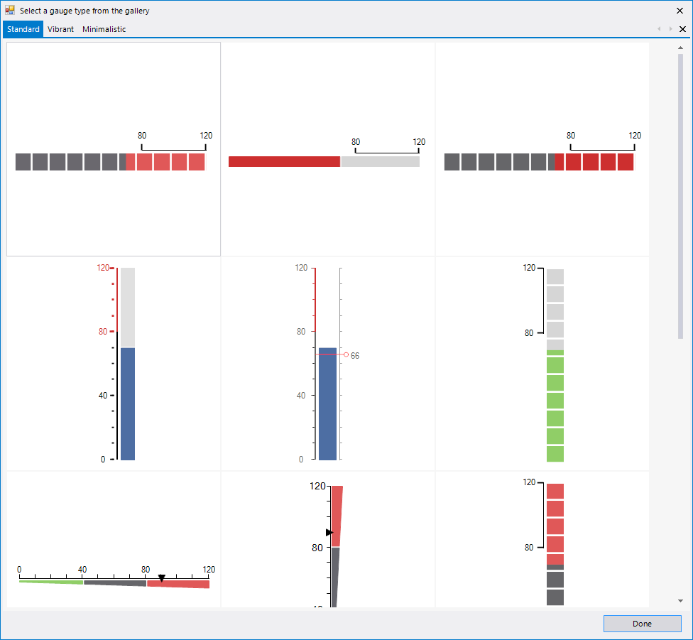
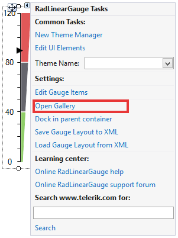
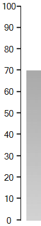

# Getting Started with WinForms LinearGauge

This article shows how you can start using **RadLinearGauge**.

## Adding Telerik Assemblies Using NuGet

To use `RadLinearGauge` when working with NuGet packages, install the `Telerik.UI.for.WinForms.AllControls` package. The [package target framework version may vary]().

Read more about NuGet installation in the [Install using NuGet Packages]() article.

>tip With the 2025 Q1 release, the Telerik UI for WinForms has a new licensing mechanism. You can learn more about it [here]().

## Adding Assembly References Manually

When dragging and dropping a control from the Visual Studio (VS) Toolbox onto the Form Designer, VS automatically adds the necessary assemblies. However, if you're adding the control programmatically, you'll need to manually reference the following assemblies:

* __Telerik.Licensing.Runtime__
* __Telerik.WinControls__
* __Telerik.WinControls.UI__
* __TelerikCommon__

The Telerik UI for WinForms assemblies can be install by using one of the available [installation approaches](). 

## Defining the RadLinearGauge

This article shows how you can add the control at design time or with code

### Design Time

When you drag a __RadLinearGauge__ from the Toolbox and then drop it on the form, the gauge gallery will offer you to pick up the desired type:

>caption Figure 1: Gallery Types

>note If you do not choose a gauge's style and just close the gallery, an empty __RadRadialGauge__ will be created.
>

You can open the gallery from the smart tag as well.
       
>caption Figure 2: Smart Tag Gallery Option 

### Adding Items Programmatically

This example demonstrates how to programmatically setup a linear gauge.

>caption Figure 3: Programmatically Added Items

#### Add Items

<snippet id='gauges-linearguagegettingstarted-add-cs' />
<snippet id='gauges-linearguagegettingstarted-add-vb' />

## See Also

* [Structure]()
* [Smart Tag]()

## Telerik UI for WinForms Learning Resources
* [Telerik UI for WinForms LinearGauge Component](https://www.telerik.com/products/winforms/lineargauge.aspx)
* [Getting Started with Telerik UI for WinForms Components](https://docs.telerik.com/devtools/winforms/getting-started/first-steps)
* [Telerik UI for WinForms Setup](https://docs.telerik.com/devtools/winforms/installation-and-upgrades/installing-on-your-computer)
* [Telerik UI for WinForms Application Modernization](https://docs.telerik.com/devtools/winforms/winforms-converter/overview)
* [Telerik UI for WinForms Visual Studio Templates](https://docs.telerik.com/devtools/winforms/visual-studio-integration/visual-studio-templates)
* [Deploy Telerik UI for WinForms Applications](https://docs.telerik.com/devtools/winforms/deployment-and-distribution/application-deployment)
* [Telerik UI for WinForms Virtual Classroom(Training Courses for Registered Users)](https://learn.telerik.com/learn/course/external/view/elearning/17/telerik-ui-for-winforms)
* [Telerik UI for WinForms License Agreement)](https://www.telerik.com/purchase/license-agreement/winforms-dlw-s)

