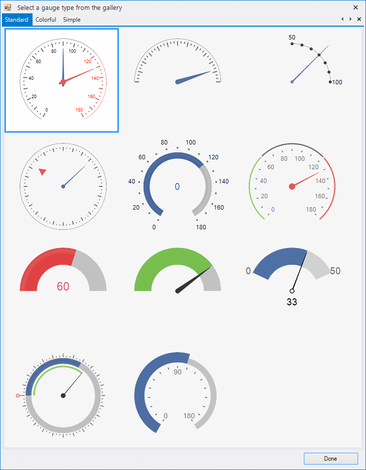
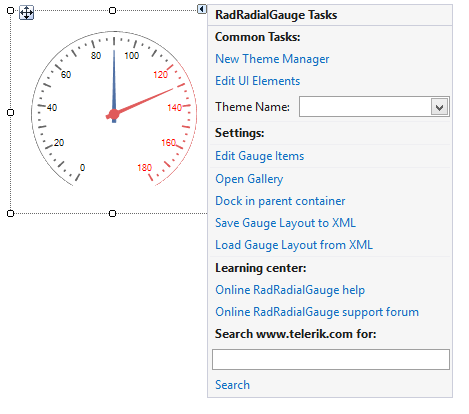
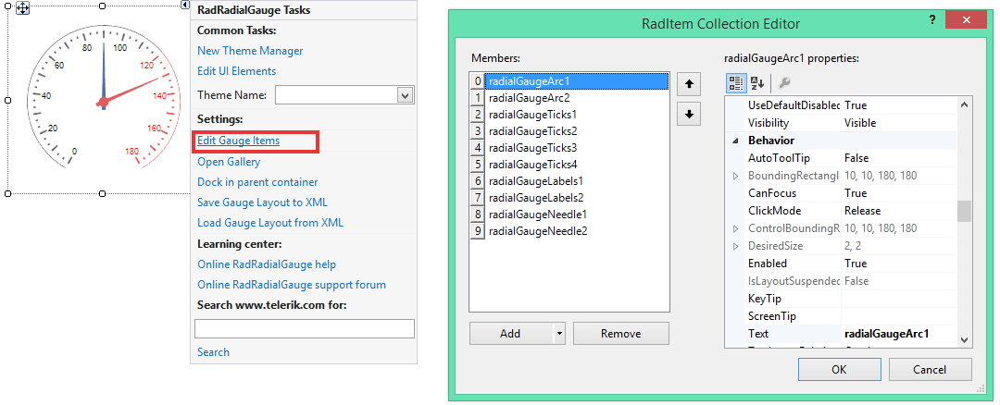
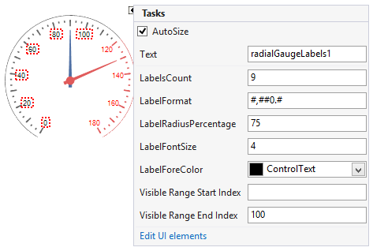

# Design Ttime Gallery

When you drag a __RadRadialGauge__ from the Toolbox and drop it onto the form, the gauge gallery will offer you to pick up the desired type:

>caption Figure 1: Gallery Types

# Smart Tag

The smart tag allows you to change the control styles, save/load its layout and edit its items.

>caption Figure 2: Smart Tag

* __Common Tasks__

	* __New Theme Manager__: Adds a new __RadThemeManager__ component to the form.

	* __Edit UI elements__: Opens a dialog that displays the *Element Hierarchy Editor*. This editor lets you browse all the elements in the control.

	* __Theme Name__: Select a theme name from the drop down list of themes available for that control. Selecting a theme allows you to change all aspects of the controls visual style at one time.

* __RadLinearGauge Specific Actions__:

	* __Edit Gauge Items__: Opens the RadItem Collection Editor populated with each of the [gauge items]().
	
	* __Open Gallary__: Opens the [gallery]() with available graph designs.
	
	* __Dock in Parent Container__: Docks the control to its parent.
	
	* __Save Gauge Layout to XML__: Saves the control`s layout to XML.

	* __Load Gauge Layout to XML__: Loads the control`s layout from XML.
	
* __Learning Center__: Navigate to the Telerik help, code library projects or support forum.

* __Search__: Search the Telerik website for a given string.

The Smart tag of __RadRadialGauge__ lets you quickly access and modify the __Items__ collection via the Smart tag's option *Edit Gauge Items*. Thus, you can add new gauge elements, modify or remove the existing ones:

>caption Figure 3: Edit Gauge Items

Additionally, you can perform some modifications to the gauge elements and save the constructed layout via the *Save Gauge Layout to XML* option. Afterwards, you can add an empty gauge and load the stored layout via the *Load Gauge Layout from XML*.

>caption Figure 4: Edit Save/Load Layout

## Elements Selection

The __RadRadialGauge__ control supports precise design time selection of the gauge elements in order to customize the selected element.

>caption Figure 5: Elements Selection

# See Also

* [Structure]()
* [Getting Started]()
* [Element Hierarchy Editor]()
