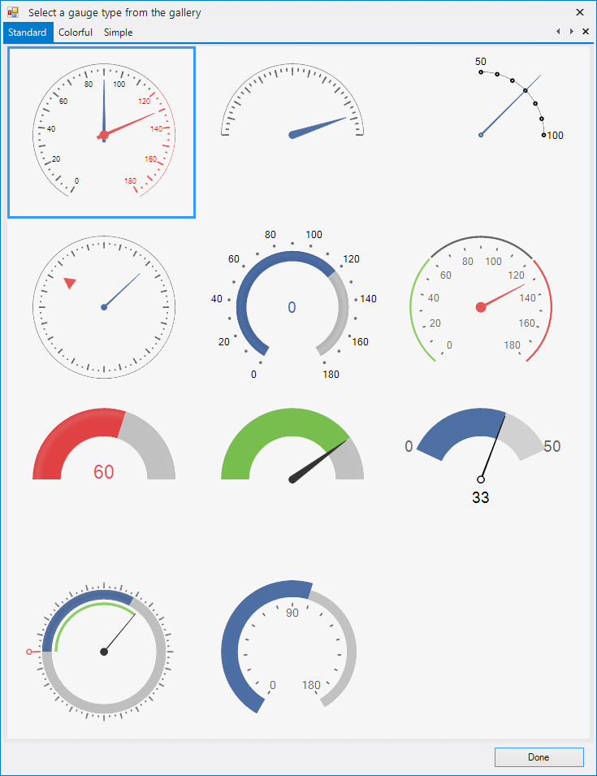
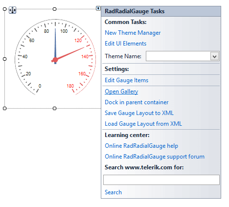
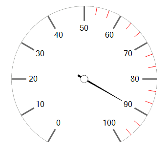
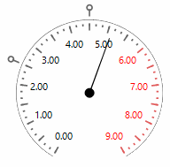
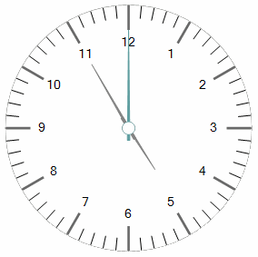

# Getting Started with WinForms RadialGauge

This article shows how you can start using **RadRadialGauge**.

## Adding Telerik Assemblies Using NuGet

To use `RadRadialGauge` when working with NuGet packages, install the `Telerik.UI.for.WinForms.AllControls` package. The [package target framework version may vary]().

Read more about NuGet installation in the [Install using NuGet Packages]() article.

>tip With the 2025 Q1 release, the Telerik UI for WinForms has a new licensing mechanism. You can learn more about it [here]().

## Adding Assembly References Manually

When dragging and dropping a control from the Visual Studio (VS) Toolbox onto the Form Designer, VS automatically adds the necessary assemblies. However, if you're adding the control programmatically, you'll need to manually reference the following assemblies:

* __Telerik.Licensing.Runtime__
* __Telerik.WinControls__
* __Telerik.WinControls.UI__
* __TelerikCommon__

The Telerik UI for WinForms assemblies can be install by using one of the available [installation approaches](). 

## Defining the RadRadialGauge

This article shows how you can add the control at design time or with code

## Design Time

When you drag a __RadRadialGauge__ from the Toolbox and drop it onto the form, the gauge gallery will offer you to pick up the desired type:

>caption Figure 1: Gallery Types

>note If you do not choose a gauge's style and just close the gallery, an empty __RadRadialGauge__ will be created.
>

You can change the gauge's style via the Smart tag's option *Open Gallery* as well.

>caption Figure 2: Change Style

## Adding Items Programmatically

You can create your own gauge's style programmatically from the scratch by adding the desired labels, ticks, needles, arcs to the RadRadialGauge.__Items__ collection. Here is a sample code snippet:

>caption Figure 3: Programmatically Added Items

#### Add Items

<snippet id='gauges-radialgaugegettingstarted-additemsprogrammatically-cs' />
<snippet id='gauges-radialgaugegettingstarted-additemsprogrammatically-vb' />

## Adding Additional Elements

Drag a __RadRadialGauge__ from the Toolbox and drop it onto the form. The gauge gallery will offer you to pick up the desired type. Select the first gauge type. Now, we will customize the gauge in order to obtain the result illustrated on the screen-shot below:

>caption Figure 4: Additional Element
 

#### Additional Element

<snippet id='gauges-radialgaugegettingstarted-advancedexample-cs' />
<snippet id='gauges-radialgaugegettingstarted-advancedexample-vb' />

## Clock Example

The following code snippet is purposed to demonstrate how to create a simple clock. For this purpose we will add the necessary clock's elements to the RadRadialGauge.__Items__ collection. Afterwards, we need to drag a timer from the Toolbox and drop it onto the form. Set the timer's __Interval__ property to *1000*. Subscribe to its __Tick__ event where we should  update the time.

>caption Figure 5: Clock
 

#### Clock

<snippet id='gauges-radialgaugegettingstarted-clock-cs' />
<snippet id='gauges-radialgaugegettingstarted-clock-vb' />

# See Also

* [Structure]()
* [Smart Tag]()
