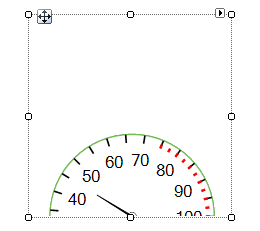
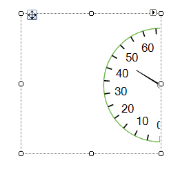
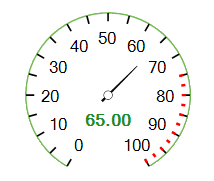
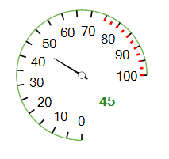
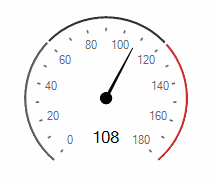

# Properties

|Property|Description|Picture|
|------|------|---|
|__CenterOffsetY__|Controls the RadRadialGauge's offset in vertical direction.||
|__CenterOffsetX__|Controls the RadRadialGauge's offset in horizontal direction.||
|__Value__|Specifies the gauge's value||
|__RangeEnd__|Specifies the gauge's end. On the picture to the right, the __RangeEnd__ is *100*.|
|
|__RangeStart__|Specifies the gauge's start. On the picture to the right, the __RangeStart__ is *0*.|
|
|__SweepAngle__|Determines the angle value starting from the StartAngle to draw an arc in clockwise direction. On the picture to the __SweepAngle__ is 270||
|__StartAngle__|Determines the angle value starting from the StartAngle to draw an arc in clockwise direction. On the picture to the __StartAngle__ is 90.||
|__XmlSerializationInfo__|Gets the serialization info for RadRadialGauge used by Save/Load loyout methods to persist grid settings to/from XML. By default, or when set to null the ComponentXmlSerializationInfo provided by GetDefaultXmlSerializationInfo() will be used.||

# Events

|Event|Description|
|------|------|
|__ValueChanged__|The ValueChanged event fires when the value is modified.|

The __ValueChanged__ event fires when the value is modified. You can perform changes to the gauge's elements in order to indicate low/high values. The following code snippet demonstrates how to color the needle and the single label in red color, when the RadRadialGauge.__Value__ gets greater than *120*.

>caption Figure 1: ValueChanged Event
 

#### Change Value

{{source=..\SamplesCS\Gauges\RadialGauge\RadialGaugePropertiesAndEvents.cs region=ValueChanged}} 
{{source=..\SamplesVB\Gauges\RadialGauge\RadialGaugePropertiesAndEvents.vb region=ValueChanged}} 

````C#
        
Timer timer1 = new Timer();
float step = 0f; 
        
public RadialGaugePropertiesAndEvents()
{
    InitializeComponent();
    
    step = -(float)(radRadialGauge1.RangeEnd - radRadialGauge1.RangeStart) / 10f;
    this.radRadialGauge1.ValueChanged += radRadialGauge1_ValueChanged;
    timer1.Interval = 1000;
    timer1.Tick += timer1_Tick;
    timer1.Start();
}
        
private void radRadialGauge1_ValueChanged(object sender, EventArgs e)
{
    if (this.radRadialGauge1.Value >= 120)
    {
        this.radialGaugeNeedle1.BackColor = Color.FromArgb(224, 90, 90);
        this.radialGaugeNeedle1.BackColor2 = Color.FromArgb(224, 90, 90);
        this.radialGaugeSingleLabel1.ForeColor = Color.FromArgb(224, 90, 90);
    }
    else
    {
        this.radialGaugeNeedle1.BackColor = Color.Black;
        this.radialGaugeNeedle1.BackColor2 = Color.Black;
        this.radialGaugeSingleLabel1.ForeColor = Color.Black;
    }
}
        
private void timer1_Tick(object sender, EventArgs e)
{
    if (radRadialGauge1.Value + step > radRadialGauge1.RangeEnd || radRadialGauge1.Value + step < radRadialGauge1.RangeStart)
    {
        step = -step;
    }
    AnimatedPropertySetting setting = new AnimatedPropertySetting(RadRadialGaugeElement.ValueProperty,
        this.radRadialGauge1.Value, radRadialGauge1.Value + step, 12, 40);
    setting.ApplyEasingType = RadEasingType.OutBounce;
    setting.ApplyValue(radRadialGauge1.GaugeElement);
}

````
````VB.NET
Private timer1 As New Timer()
Private [step] As Single = 0.0F
Public Sub New()
    InitializeComponent()
    [step] = -CSng(RadRadialGauge1.RangeEnd - RadRadialGauge1.RangeStart) / 10.0F
    AddHandler Me.RadRadialGauge1.ValueChanged, AddressOf radRadialGauge1_ValueChanged
    timer1.Interval = 1000
    AddHandler timer1.Tick, AddressOf timer1_Tick
    timer1.Start()
End Sub
Private Sub radRadialGauge1_ValueChanged(sender As Object, e As EventArgs)
    If Me.RadRadialGauge1.Value >= 120 Then
        Me.RadialGaugeNeedle1.BackColor = Color.FromArgb(224, 90, 90)
        Me.RadialGaugeNeedle1.BackColor2 = Color.FromArgb(224, 90, 90)
        Me.RadialGaugeSingleLabel1.ForeColor = Color.FromArgb(224, 90, 90)
    Else
        Me.RadialGaugeNeedle1.BackColor = Color.Black
        Me.RadialGaugeNeedle1.BackColor2 = Color.Black
        Me.RadialGaugeSingleLabel1.ForeColor = Color.Black
    End If
End Sub
Private Sub timer1_Tick(sender As Object, e As EventArgs)
    If RadRadialGauge1.Value + [step] > RadRadialGauge1.RangeEnd OrElse RadRadialGauge1.Value + [step] < RadRadialGauge1.RangeStart Then
        [step] = -[step]
    End If
    Dim setting As New AnimatedPropertySetting(RadRadialGaugeElement.ValueProperty, Me.RadRadialGauge1.Value, RadRadialGauge1.Value + [step], 12, 40)
    setting.ApplyEasingType = RadEasingType.OutBounce
    setting.ApplyValue(RadRadialGauge1.GaugeElement)
End Sub

````

{{endregion}}

# See Also

* [Properties](https://docs.telerik.com/devtools/winforms/api/telerik.wincontrols.ui.gauges.radradialgauge.html#properties)
* [Events](https://docs.telerik.com/devtools/winforms/api/telerik.wincontrols.ui.gauges.radradialgauge.html#events)
