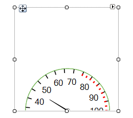
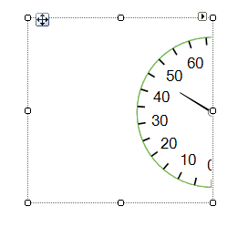
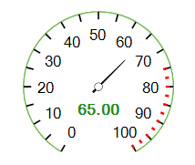
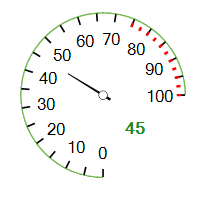
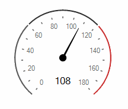

# Properties

|Property|Description|Picture|
|------|------|---|
|__CenterOffsetY__|Controls the RadRadialGauge's offset in vertical direction.||
|__CenterOffsetX__|Controls the RadRadialGauge's offset in horizontal direction.||
|__Value__|Specifies the gauge's value||
|__RangeEnd__|Specifies the gauge's end. On the picture to the right, the __RangeEnd__ is *100*.|
|
|__RangeStart__|Specifies the gauge's start. On the picture to the right, the __RangeStart__ is *0*.|
|
|__SweepAngle__|Determines the angle value starting from the StartAngle to draw an arc in clockwise direction. On the picture to the __SweepAngle__ is 270||
|__StartAngle__|Determines the angle value starting from the StartAngle to draw an arc in clockwise direction. On the picture to the __StartAngle__ is 90.||
|__XmlSerializationInfo__|Gets the serialization info for RadRadialGauge used by Save/Load loyout methods to persist grid settings to/from XML. By default, or when set to null the ComponentXmlSerializationInfo provided by GetDefaultXmlSerializationInfo() will be used.||

# Events

|Event|Description|
|------|------|
|__ValueChanged__|The ValueChanged event fires when the value is modified.|

The __ValueChanged__ event fires when the value is modified. You can perform changes to the gauge's elements in order to indicate low/high values. The following code snippet demonstrates how to color the needle and the single label in red color, when the RadRadialGauge.__Value__ gets greater than *120*.

>caption Figure 1: ValueChanged Event
 

#### Change Value

<snippet id='gauges-radialgaugepropertiesandevents-valuechanged-cs' />
<snippet id='gauges-radialgaugepropertiesandevents-valuechanged-vb' />

# See Also

* [Properties](https://docs.telerik.com/devtools/winforms/api/telerik.wincontrols.ui.gauges.radradialgauge.html#properties)
* [Events](https://docs.telerik.com/devtools/winforms/api/telerik.wincontrols.ui.gauges.radradialgauge.html#events)
