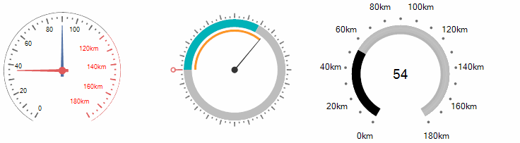

# RadialGauge

The __RadRadialGauge__ control is designed to display a simple value within a definite range. This range is represented in a circular format similar to car speed gauge. The circular container contains a scale in it which controls the overall layout of [ticks](), [tick labels](), [needles]() and [ranges]() and renders an optional scale bar.





## Key Features

* Fully customizable elements

* Precise design time selection of the gauge elements

* Animation effects when the value is changed

* Abundant in gauges style

>tip In the related [Getting Started](https://docs.telerik.com/devtools/winforms/controls/gauges/radialgauge/getting-started) article you can find how to use the control with a sample scenario.

> Download and check out the online demo at [demos.telerik.com](https://telerik-winforms-demos.s3.amazonaws.com/TelerikWinFormsExamplesLauncher.exe)

# See Also

* [Getting Started]()
* [Structure]()
* [Properties, Methods and Events]()
* [Save and Load layout]()