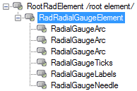
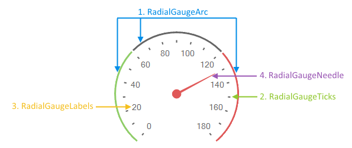

# Structure

This article describes the inner structure and organization of the elements which build the __RadRadialGauge__ control.

>caption Figure 1: RadRadialGauge`s Element Hierarchy

>caption Figure 2: RadRadialGauge`s Structure

1. [RadialGaugeArc](): This element represents a band spanning across the measure.

1. [RadialGaugeTicks](): Elements displayed below the arc.

1. [RadialGaugeLabels](): Scale labels representing the measure.

1. [RadialGaugeNeedle](): Allows you to show labels next to the scale ticks.

## See Also

* [Smart Tag]()
* [Getting Started]()
