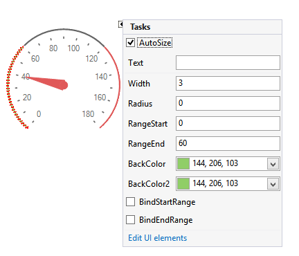
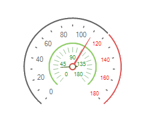
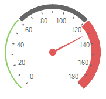
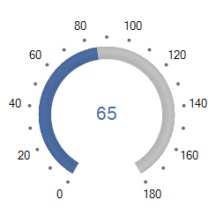

# Working with Arcs

__RadialGaugeArc__ is rendered as a continuous band spanning the entire sweep angle. The arc is also used as a basis for the placement of child elements, such as the tick marks and labels.

>caption Figure 1: Arc

* __Radius:__ Controls the radius of the arc. In the image below, the green arc has a smaller radius than the dark gray one. This allows several arcs to be defined and positioned as desired.

>caption Figure 2: Radius

* __RangeStart:__ Specifies the start value of the arc and moves clock-wise to the __RangeEnd__ value. On the above picture the dark gray arc starts from 0, but the red one starts from 121.

* __RangeEnd:__ Specifies the end value of the arc. On the above picture the dark gray arc ends with 120, but the red one ends with 180.        

* __Width:__ Controls how thick the arc will be rendered.

>caption Figure 3: Width

* __BackColor__ and __BackColor2:__ Specifies the fill colors for the arc.

* __BindStartRange:__ Indicates whether the __RangeStart__ property is bound to the gauge's __Value__. Changing the gauge's value will change the start range of the arc respectively.

* __BindEndRange:__ Indicates whether the __RangeEnd__ property is bound to the gauge's __Value__. Changing the gauge's value will change the end range of the arc respectively.

* __BindStartRangeOffset:__ Specifies the start range offset of the arc according to the gauge's value.

* __BindEndRangeOffset:__ Specifies the end range offset of the arc according to the gauge's value.

>caption Figure 4: Offset            

# See Also

* [Structure]()
* [Design Time]()
* [Properties and Events]()
