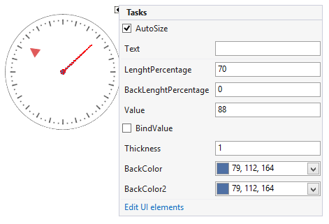
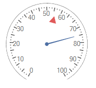
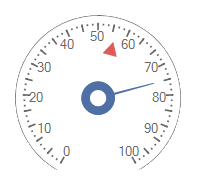
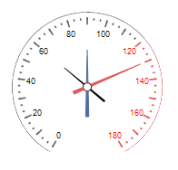
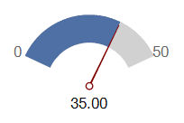
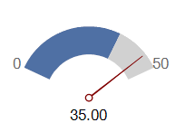

# Working with needles

__RadialGaugeNeedle__ is a scale indicator that points to a value. To add a needle to the gauge, you should add it via the RadradialGauge. __Items__ collection. 

>caption Figure 1: Needle

## Properties

* __Value__ - specifies the needle's value.

>caption Figure 2: Value            

* __Thickness:__ Controls how thick the needle will be rendered.

* __PointRadiusPercentage:__ Specifies the outer radius of the needle's start point.

* __InnerPointRadiusPercentage:__ Specifies the inner radius of the needle's start point.

>caption Figure 3: Inner Radius            

* __LenghtPercentage:__ Controls how long the needle will be rendered.

* __BackLenghtPercentage:__ The value with which the needle juts out from the center point.

>caption Figure 4: Back Length Percentage            

* __BindValue:__ Indicates whether the needle's value is bound to the gauge's __Value__.

>caption Figure 5: Bind Value            

* __BindOffset:__ Specifies the value offset of the needle according to the gauge's value.

>caption Figure 6: Offset

## Events

The __ValueChanged__ event fires when the needle's value is modified.

# See Also

* [Structure]()
* [Design Time]()
* [Properties and Events]()
      
