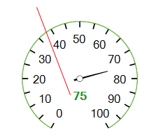
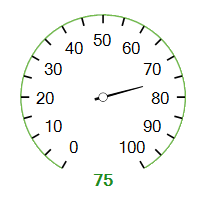
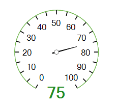
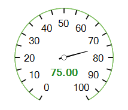

# Working with a Single Label

__RadialGaugeSingleLabel__ is suitable to present additional information for the __RadRadialGauge__, e.g. current value.To add a single label to the gauge, you should add it via the RadradialGauge.__Items__ collection.

>caption Figure 1: Single Label

You can customize the single label's look by using the following properties:

* __BindValue:__ Indicates whether the single label's text is bound to the gauge's __Value__.

* __LocationPercentage:__ Controls the label's location (x, y) according to the center point.  __LocationPercentage:__ Accepts values withing the range [(-1,-1), (1,1)]. On the picture below, the green single label has __LocationPercentage__ = *(0, 1)*.

>caption Figure 2: Location Percentage

* __LabelFontSize:__ Specifies the label size.

>caption Figure 3: Font Size

* __LabelFormat:__ Specifies the label format. By default, it is set to *#,##0.#*. On the following picture the single label has format *N2*.

>caption Figure 3: Format            

# See Also

* [Structure]()
* [Design Time]()
* [Properties and Events]()