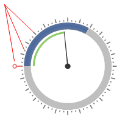
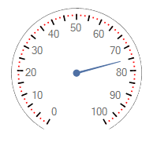
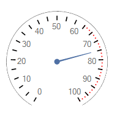
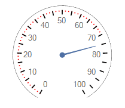
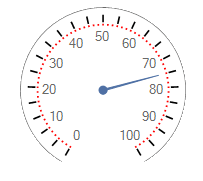
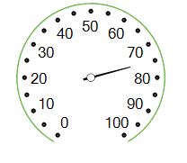
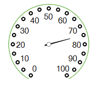
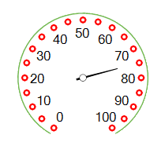
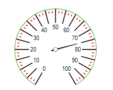
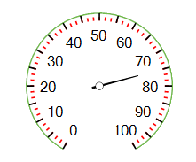

# Working with Ticks

__RadialGaugeTicks__ are displayed next to the arc spanning the entire sweep angle.

>caption Figure 1: Radial Gauge Ticks

The following properties allow you to modify the ticks' look:

* __TicksCount:__ Specifies how many ticks will be displayed. On the following picture the black ticks are 24, but the red ticks are 72.

>note  __RadRadialGauge__ always displays one additional tick to the __TicksCount__ in order to distribute the ticks correctly on the arc.

>caption Figure 2: Ticks Count

* __TickStartIndexVisibleRange:__ Specifies at which index the visible ticks range will start. On the following picture the red ticks start from index 45:

>caption Figure 3: Start Visible Range            

* __TickEndIndexVisibleRange:__ Specifies at which index the visible ticks range will end. On the following picture the red ticks ends with index 50:

>caption Figure 4: End Visible Range

* __TicksRadiusPercentage:__  Controls how far according to the gauge's arc the ticks will be rendered. On the following picture, the red ticks have __TicksRadiusPercentage__ 80.

>caption Figure 5: Radius Percentage

* __CircleTicks:__ Controls whether the specific ticks are circle or not.

>caption Figure 6: Circle Ticks            

* __TickThickness:__ Specifies how thick the ticks will be rendered.

>caption Figure 7: Thickness

* __TickColor:__ Specifies the back color for the ticks

>caption Figure 8: Color

* __TicksOffset:__ Specifies the ticks back length towards the center point.

>caption Figure 9: Offset

* __TicksLenghtPercentage:__ Controls the ticks length. On the picture below, the black ticks are with __TicksLenghtPercentage__ 10, but the red ones with 5.

>caption Figure 10: Length Percentage            

# See Also

* [Structure]()
* [Design Time]()
* [Properties and Events]()
