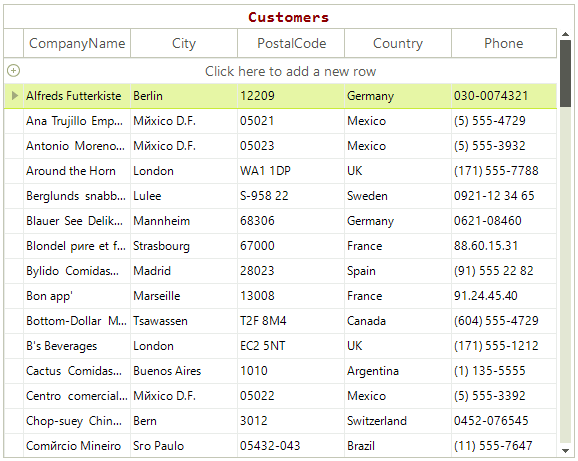

## Title

Since R3 2018 SP1 RadGridView supports displaying a Title(Caption). By default the Title is displayed on top. The position and the alignment of the title text can be easily changed. 



## Showing the Title

To show the title just set the __TitleText__ property. In addition the following snippet shows how you can set the font and the ForeColor.

{{source=..\SamplesCS\GridView\GridTitle\GridTitle.cs region=ShowTitle}} 
{{source=..\SamplesVB\GridView\GridTitle\GridTitle.vb region=ShowTitle}}

````C#
radGridView1.TitleText = "Customers";
radGridView1.GridViewElement.TitleLabelElement.ForeColor = Color.DarkRed;
radGridView1.GridViewElement.TitleLabelElement.Font = new Font("Consolas", 12, FontStyle.Bold);

````
````VB.NET
radGridView1.TitleText = "Customers"
radGridView1.GridViewElement.TitleLabelElement.ForeColor = Color.DarkRed
radGridView1.GridViewElement.TitleLabelElement.Font = New Font("Consolas", 12, FontStyle.Bold)

```` 

{{endregion}} 

>note If the **TitleText** is set to an empty string, the GridViewElement.**TitleLabelElement** is collapsed. Otherwise, it is always shown and if you need to hide it, it is necessary to manage the GridViewElement.TitleLabelElement.**Visibility** property. 

## Changing the Position of the Title

To change the position you can use the __TitlePosition__ property. In addition you can set the __FlipText__ property. The __TitleLabelElement__ property allows you to access the actual label element. This element is a [LightVisualElement]() which is capable of displaying text and image.


{{source=..\SamplesCS\GridView\GridTitle\GridTitle.cs region=Position}} 
{{source=..\SamplesVB\GridView\GridTitle\GridTitle.vb region=Position}}
````C#
radGridView1.TitlePosition = Telerik.WinControls.Layouts.Dock.Left;
radGridView1.GridViewElement.TitleLabelElement.TextOrientation = Orientation.Vertical;
radGridView1.GridViewElement.TitleLabelElement.FlipText = true;

````
````VB.NET
radGridView1.TitlePosition = Telerik.WinControls.Layouts.Dock.Left
radGridView1.GridViewElement.TitleLabelElement.TextOrientation = Orientation.Vertical
radGridView1.GridViewElement.TitleLabelElement.FlipText = True

````

{{endregion}} 


# See Also

* [Getting Started]()

* [Overview]()
