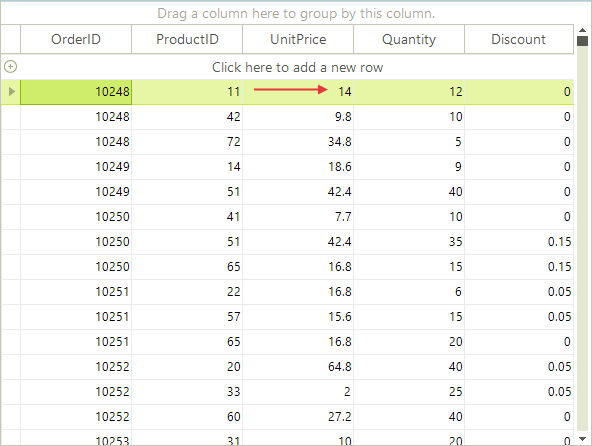

# Merged Cells


Cells can be accessed by index or the column __Name__ property.

>note RadGridView uses virtualization for its visual elements. This means that only the rows that are currently visible have a visual element. When the grid is scrolled up and down the visual elements are reused. Because of the virtualization, it is safe to use the __CellElement__ only inside the __CellFormatting__ event and only for the current cell.
>

>note When assigning values to several cells subsequently, the RadGridView should be placed between __BeginUpdate()__ and __EndUpdate()__ method invocations of the desired template. See section "Multiple assignments of cell values" below for more information.
>


## Accessing cells by column Name

In this example we will change a cell value to 10 if it is greater than 10. In this case we assume that there is a "UnitPrice" column and we modify the cell in its first row.

{{source=..\SamplesCS\GridView\Cells\AccessingCells.cs region=accessingCellsByColumnName}} 
{{source=..\SamplesVB\GridView\Cells\AccessingCells.vb region=accessingCellsByColumnName}} 

````C#
if ((decimal)radGridView1.Rows[0].Cells["UnitPrice"].Value > 10)
    radGridView1.Rows[0].Cells["UnitPrice"].Value = 10;

````
````VB.NET
If DirectCast(RadGridView1.Rows(0).Cells("UnitPrice").Value, Decimal) > 10 Then
    RadGridView1.Rows(0).Cells("UnitPrice").Value = 10
End If

````

{{endregion}} 

>caption Figure 1: Before setting the value.




## See Also
* [Accessing and Setting the CurrentCell]()

* [Conditional Formatting Cells]()

* [Creating Custom Cells]()

* [Formatting Cells]()

* [GridViewCellInfo]()

* [Iterating Cells]()

* [Painting and Drawing in Cells]()

* [ToolTips]()

