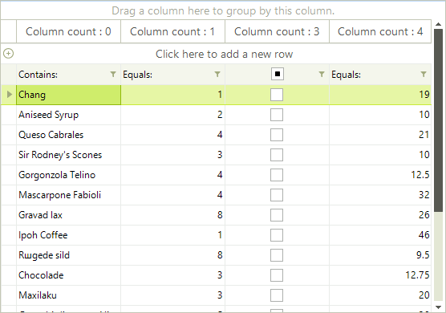

# Accessing and Iterating through Columns

## Accessing Columns

You can access any column by name or index. Generally speaking, accessing the columns by name is the preferred approach because if the user reorders the columns the indexes would also change.

For example, the code snippet below sets the width of an image column named "Picture" to 110: 

#### Accessing RadGridView columns

{{source=..\SamplesCS\GridView\Columns\AccessingAndIteratingThroughColumns.cs region=accessingColumns}} 
{{source=..\SamplesVB\GridView\Columns\AccessingAndIteratingThroughColumns.vb region=accessingColumns}} 

````C#
((GridViewImageColumn)this.radGridView1.Columns["Picture"]).Width = 110;

````
````VB.NET
DirectCast(Me.RadGridView1.Columns("Picture"), GridViewImageColumn).Width = 110

````

{{endregion}}

## Iterating through Columns

You can iterate through grid columns by using the __Columns__ collection of GridViewColumn objects. The example below cycles through the columns of the grid, it first determines if the column is a GridViewDataColumn type, and then sets each column’s HeaderText with the number of the current column:

#### Iterating through RadGridView columns

{{source=..\SamplesCS\GridView\Columns\AccessingAndIteratingThroughColumns.cs region=iteratingColumns}} 
{{source=..\SamplesVB\GridView\Columns\AccessingAndIteratingThroughColumns.vb region=iteratingColumns}} 

````C#
int i = 0;
foreach (GridViewColumn column in radGridView1.Columns)
{
    if (column is GridViewDataColumn)
    {
        GridViewDataColumn col = column as GridViewDataColumn;
        if (col != null)
        {
            col.Width = 90;
            col.HeaderText = "Column count : " + i.ToString();
            i++;
        }
    }
}

````
````VB.NET
Dim i As Integer = 0
For Each column As GridViewColumn In RadGridView1.Columns
    If TypeOf column Is GridViewDataColumn Then
        Dim col As GridViewDataColumn = TryCast(column, GridViewDataColumn)
        col.Width = 90
        col.HeaderText = "Column count: " + i.ToString
        i = i + 1
    End If
Next

````

{{endregion}}

>caption Figure 1: Iterating columns and setting their HeaderText.



## Iterating through Hierarchical Columns

Iterating through hierarchical RadGridView is possible by iterating through the __Columns__’ collection of each RadGridView template (each template represents one level of hierarchy).

#### Iterating through hierarchical RadGridView columns

{{source=..\SamplesCS\GridView\Columns\AccessingAndIteratingThroughColumns2.cs region=iterateColumnsInHierarchy}} 
{{source=..\SamplesVB\GridView\Columns\AccessingAndIteratingThroughColumns2.vb region=iterateColumnsInHierarchy}} 

````C#
private void AccessingAndIteratingThroughColumns2_Load(object sender, EventArgs e)
{
    this.order_DetailsTableAdapter.Fill(this.nwindDataSet.Order_Details);
    this.ordersTableAdapter.Fill(this.nwindDataSet.Orders);
    this.customersTableAdapter.Fill(this.nwindDataSet.Customers);
    radGridView1.AutoGenerateHierarchy = true;
    radGridView1.DataSource = this.nwindDataSet;
    radGridView1.DataMember = "Customers";
    int count = 0;
    foreach (GridViewDataColumn dataColumn in this.GetAllColumns(this.radGridView1.MasterTemplate))
    {
        dataColumn.WrapText = true;
        dataColumn.HeaderText = "Column count: " + count++;
    }
}
public List<GridViewDataColumn> GetAllColumns(GridViewTemplate template)
{
    List<GridViewDataColumn> allColumns = new List<GridViewDataColumn>();
    allColumns.AddRange(template.Columns);
    foreach (GridViewTemplate childTemplate in template.Templates)
    {
        List<GridViewDataColumn> childColumns = this.GetAllColumns(childTemplate);
        allColumns.AddRange(childColumns);
    }
    return allColumns;
}

````
````VB.NET
Private Sub AccessingAndIteratingThroughColumns2_Load(ByVal sender As System.Object, ByVal e As System.EventArgs) Handles MyBase.Load
    Me.Order_DetailsTableAdapter.Fill(Me.NwindDataSet.Order_Details)
    Me.OrdersTableAdapter.Fill(Me.NwindDataSet.Orders)
    Me.CustomersTableAdapter.Fill(Me.NwindDataSet.Customers)
    RadGridView1.AutoGenerateHierarchy = True
        RadGridView1.DataSource = Me.NwindDataSet
        RadGridView1.DataMember = "Customers"

        Dim count As Integer = 0
        For Each dataColumn As GridViewDataColumn In Me.GetAllColumns(Me.RadGridView1.MasterTemplate)
            dataColumn.WrapText = True
            dataColumn.HeaderText = "Column count: " & System.Math.Max(System.Threading.Interlocked.Increment(count), count - 1)
        Next
    End Sub
Public Function GetAllColumns(ByVal template As GridViewTemplate) As List(Of GridViewDataColumn)
        Dim allColumns As New List(Of GridViewDataColumn)()

        allColumns.AddRange(template.Columns)

        For Each childTemplate As GridViewTemplate In template.Templates
            Dim childColumns As List(Of GridViewDataColumn) = Me.GetAllColumns(childTemplate)
            allColumns.AddRange(childColumns)
        Next

        Return allColumns
    End Function

````

{{endregion}} 
# See Also
* [Calculated Columns (Column Expressions)]()

* [Overview]()

* [Converting Data Types]()

* [Data Formatting]()

* [Generating Columns]()

* [GridViewColumn]()

* [GridViewDataColumn]()

* [Pinning and Unpinning Columns]()

