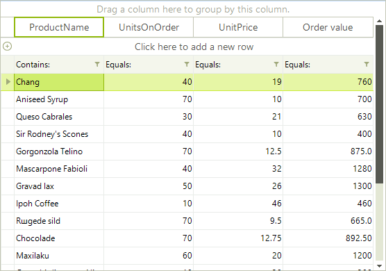

# Calculated Columns (Column Expressions)

A calculated column is identified by an expression. The only condition necessary to make a regular column behave like a calculated column is to set an expression to it. 

The following code snippet demonstrates how the standard deviation of the *Consumption* column can be computed for each month in the *Deviation* column.

#### Creating a calculated column

{{source=..\SamplesCS\GridView\Columns\CalculatedColumn.cs region=calculatedColumn}} 
{{source=..\SamplesVB\GridView\Columns\CalculatedColumn.vb region=calculatedColumn}} 

````C#
GridViewDecimalColumn col = new GridViewDecimalColumn();
col.Name = "Calculated Column";
col.HeaderText = "Order value";
radGridView1.Columns.Add(col);
radGridView1.Columns["Calculated Column"].Expression = "UnitsOnOrder * UnitPrice";

````
````VB.NET
Dim col = New GridViewDecimalColumn()
col.Name = "Calculated Column"
col.HeaderText = "Order value"
RadGridView1.Columns.Add(col)
RadGridView1.Columns("Calculated Column").Expression = "UnitsOnOrder * UnitPrice"

````

{{endregion}} 

>caption Figure 1: The last column values are calculated dynamically.
 


## Expressions

An expression is evaluated to a value by combining values from multiple cells of the same row and aggregates on the columns using the provided operators. 

For decimal columns, you can use simple arithmetic operators like '+' and '*'. You can also use logical operators like '=' and '<'. 

Boolean operators (AND, OR, NOT) are also allowed as well as more complex operators like IN, LIKE, and % (modulus). Operators take the usual precedence. You can alter this precedence using parentheses. 

The wildcards % and * are supported for Text columns, but only at the beginning or the end of a string. Column names are used as keywords and must be *unquoted*. Names (strings) must always be single-quoted.

__Example 1:__

Country = 'USA' Year >= 1999 And LastName LIKE 'A%' Price * 0.2 + Freight

Dates must be surrounded by the # character.

__Example 2:__

HireDate  #2-1-2002#

The expression parser does not recognize the __Enum__ values unless you cast them to an actual value or type. 

Decimal values can be used as long as they are represented by a literal matching the current system locale.

The __IIF__ function can be used to evaluate a predicate.

__Example 3:__

"IIF(total > 1000, 'expensive', 'dear') 

## Custom functions

The following article shows how you can create custom functions: [Customizing RadExpressionEditor]().

## Advanced usage

Refer to the following external resource about further information on the expressions syntax:

[http://msdn.microsoft.com/en-us/library/system.data.datacolumn.expression%28VS.80%29.aspx](http://msdn.microsoft.com/en-us/library/system.data.datacolumn.expression%28VS.80%29.aspx)
# See Also
* [Accessing and Iterating through Columns]()

* [Converting Data Types]()

* [Data Formatting]()

* [Generating Columns]()

* [GridViewColumn]()

* [GridViewDataColumn]()

* [Pinning and Unpinning Columns]()

