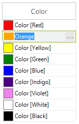
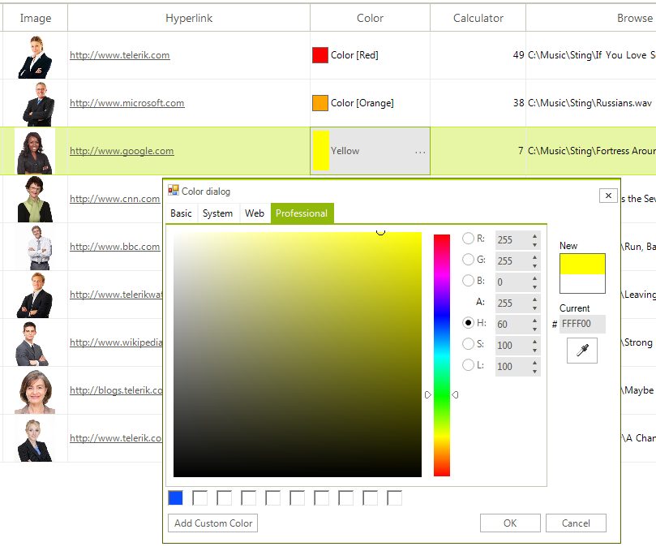

# GridViewColorColumn

__GridViewColorColumn__ allows **RadGridView** to edit colors using [RadColorDialog](). 



__GridViewColorColumn__ is auto-generated for __Color__ properties in the RadGridView.**DataSource**. The following code snippet demonstrates how to create it manually, add it to **RadGridView** and populate it with data:

{{source=..\SamplesCS\GridView\Columns\GridViewColorColumn1.cs region=addColorColumn}} 
{{source=..\SamplesVB\GridView\Columns\GridViewColorColumn1.vb region=addColorColumn}} 

````C#
GridViewColorColumn column = new GridViewColorColumn("Color column");
this.radGridView1.Columns.Add(column);
this.radGridView1.Rows.Add("Red");
this.radGridView1.Rows.Add("Orange");
this.radGridView1.Rows.Add("Yellow");
this.radGridView1.Rows.Add("Green");
this.radGridView1.Rows.Add("Blue");
this.radGridView1.Rows.Add("Indigo");
this.radGridView1.Rows.Add("Violet");

````
````VB.NET
Dim column As New GridViewColorColumn("Color column")
Me.radGridView1.Columns.Add(column)
Me.radGridView1.Rows.Add("Red")
Me.radGridView1.Rows.Add("Orange")
Me.radGridView1.Rows.Add("Yellow")
Me.radGridView1.Rows.Add("Green")
Me.radGridView1.Rows.Add("Blue")
Me.radGridView1.Rows.Add("Indigo")
Me.radGridView1.Rows.Add("Violet")

````

{{endregion}} 

## GridColorPickerEditor

The default editor of the **GridViewColorColumn** is __GridColorPickerEditor__ which can be accessed in the **CellEditorInitialized** event. The **RadColorPickerEditorElement** gives you full access to the **RadColorDialogForm** by accessing the GridColorPickerElement.ColorDialog.**ColorDialogForm** property.



# See Also
* [GridViewBrowseColumn]()

* [GridViewCalculatorColumn]()

* [GridViewCheckBoxColumn]()

* [GridViewComboBoxColumn]()

* [GridViewCommandColumn]()

* [GridViewDateTimeColumn]()

* [GridViewDecimalColumn]()

* [GridViewHyperlinkColumn]()

* [GridViewSparklineColumn]()

