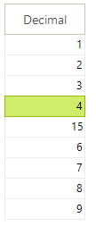

# GridViewDecimalColumn

__GridViewDecimalColumn__ allows decimal data to be displayed and edited. __GridViewDecimalColumn__ can be bound to fields of any numeric type. 



#### Add GridViewDecimalColumn to the grid.

{{source=..\SamplesCS\GridView\Columns\GridViewDecimalColumn1.cs region=addingDecimalColumn}} 
{{source=..\SamplesVB\GridView\Columns\GridViewDecimalColumn1.vb region=addingDecimalColumn}} 

````C#
GridViewDecimalColumn decimalColumn = new GridViewDecimalColumn();
decimalColumn.Name = "DecimalColumn";
decimalColumn.HeaderText = "Unit Price";
decimalColumn.FieldName = "UnitPrice";
decimalColumn.DecimalPlaces = 3;
radGridView1.MasterTemplate.Columns.Add(decimalColumn);

````
````VB.NET
Dim decimalColumn As New GridViewDecimalColumn()
decimalColumn.Name = "DecimalColumn"
decimalColumn.HeaderText = "Unit Price"
decimalColumn.FieldName = "UnitPrice"
decimalColumn.DecimalPlaces = 3
RadGridView1.MasterTemplate.Columns.Add(decimalColumn)

````

{{endregion}} 

## Setting a default value for empty cells

You may provide a default value using the following code:

{{source=..\SamplesCS\GridView\Columns\GridViewDecimalColumn1.cs region=settingTheDefaultValue}} 
{{source=..\SamplesVB\GridView\Columns\GridViewDecimalColumn1.vb region=settingTheDefaultValue}} 

````C#
void radGridView1_CellEditorInitialized(object sender, GridViewCellEventArgs e)
{
    GridSpinEditor spinEditor = this.radGridView1.ActiveEditor as GridSpinEditor;
    if (spinEditor != null)
    {
        if (spinEditor.Value == null)
        {
            spinEditor.Value = 0.0;
        }
    }
}

````
````VB.NET
Private Sub RadGridView1_CellEditorInitialized(ByVal sender As Object, ByVal e As Telerik.WinControls.UI.GridViewCellEventArgs)
    Dim spinEditor As GridSpinEditor = TryCast(Me.RadGridView1.ActiveEditor, GridSpinEditor)
    If spinEditor IsNot Nothing Then
        spinEditor.Value = 0
    End If
End Sub

````

{{endregion}} 


##  Disable the up and down buttons of the spin editor

The code below demonstrates how you can disable the up and down arrow buttons. Using the commented code you can completely hide them.

{{source=..\SamplesCS\GridView\Columns\GridViewDecimalColumn1.cs region=ShowUpDownButtons}} 
{{source=..\SamplesVB\GridView\Columns\GridViewDecimalColumn1.vb region=ShowUpDownButtons}} 

````C#
void radGridView1_CellEditorInitialized1(object sender, GridViewCellEventArgs e)
{
    GridSpinEditor spinEditor = this.radGridView1.ActiveEditor as GridSpinEditor;
    ((RadSpinEditorElement)spinEditor.EditorElement).ShowUpDownButtons = false;
}

````
````VB.NET
Private Sub RadGridView1_CellEditorInitialized1(ByVal sender As Object, ByVal e As Telerik.WinControls.UI.GridViewCellEventArgs)
    Dim spinEditor As GridSpinEditor = TryCast(Me.RadGridView1.ActiveEditor, GridSpinEditor)
    If spinEditor IsNot Nothing Then
        Dim element As RadSpinEditorElement = spinEditor.EditorElement
        element.ShowUpDownButtons = False
    End If
End Sub

````

{{endregion}} 

## Setting decimal places

The rich API of RadGridView allows you to define one value for the decimal places that should be shown in the spin editor of the column and another value for the cells of the column.

__Setting decimal places to the spin editor__

You can define how many places after the decimal point the value in the spin editor should have by setting the __DecimalPlaces__ property of GridViewDecimalColumn:

{{source=..\SamplesCS\GridView\Columns\GridViewDecimalColumn1.cs region=decimalPlacesEditor}} 
{{source=..\SamplesVB\GridView\Columns\GridViewDecimalColumn1.vb region=decimalPlacesEditor}} 

````C#
decimalColumn.DecimalPlaces = 3;

````
````VB.NET
decimalColumn.DecimalPlaces = 3

````

{{endregion}} 


__Setting decimal places to the column cells__

In order to define how the values should be displayed by the cells of the GridViewDecimalColumn in the sense of their decimal places, we should set the __FormatString__ property of the column:

{{source=..\SamplesCS\GridView\Columns\GridViewDecimalColumn1.cs region=decimalPlacesCell}} 
{{source=..\SamplesVB\GridView\Columns\GridViewDecimalColumn1.vb region=decimalPlacesCell}} 

````C#
decimalColumn.FormatString = "{0:N2}";

````
````VB.NET
decimalColumn.FormatString = "{0:N2}"

````

{{endregion}} 

>note For a list of the standard numeric format strings, see [Standard Numeric Format Strings](http://msdn.microsoft.com/en-us/library/dwhawy9k.aspx)
>

# See Also
* [GridViewBrowseColumn]()

* [GridViewCalculatorColumn]()

* [GridViewCheckBoxColumn]()

* [GridViewColorColumn]()

* [GridViewComboBoxColumn]()

* [GridViewCommandColumn]()

* [GridViewDateTimeColumn]()

* [GridViewHyperlinkColumn]()

* [GridViewSparklineColumn]()

* [How to Skip Rounding Decimal Values in GridView]()

