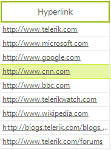

# GridViewHyperlinkColumn

__GridViewHyperlinkColumn__ allows __RadGridView__ to display, format, edit and open hyperlinks as well as run executable files. The default editor of the column is __RadTextBoxEditor__.

Here is how to create and populate __GridViewHyperlinkColumn__:

{{source=..\SamplesCS\GridView\Columns\GridViewHyperlinkColumn1.cs region=addHyperlinkColumn}} 
{{source=..\SamplesVB\GridView\Columns\GridViewHyperlinkColumn1.vb region=addHyperlinkColumn}} 

````C#
GridViewHyperlinkColumn column = new GridViewHyperlinkColumn("Hyperlink column");
this.radGridView1.Columns.Add(column);
            
this.radGridView1.Rows.Add("http://www.telerik.com");
this.radGridView1.Rows.Add("http://www.microsoft.com");
this.radGridView1.Rows.Add("http://www.google.com");
this.radGridView1.Rows.Add("http://www.cnn.com");
this.radGridView1.Rows.Add("http://www.bbc.com");
this.radGridView1.Rows.Add("http://www.telerikwatch.com/");
this.radGridView1.Rows.Add("http://www.wikipedia.com");

````
````VB.NET
Dim column As New GridViewHyperlinkColumn("Hyperlink column")
Me.radGridView1.Columns.Add(column)
Me.radGridView1.Rows.Add("http://www.telerik.com")
Me.radGridView1.Rows.Add("http://www.microsoft.com")
Me.radGridView1.Rows.Add("http://www.google.com")
Me.radGridView1.Rows.Add("http://www.cnn.com")
Me.radGridView1.Rows.Add("http://www.bbc.com")
Me.radGridView1.Rows.Add("http://www.telerikwatch.com/")
Me.radGridView1.Rows.Add("http://www.wikipedia.com")

````

{{endregion}} 



## Behavior customization

You can choose the action to open hyperlink or run executable using the __HyperlinkOpenAction__ property of the column. It is an enumeration with the following members:

* __SingleClick:__ opens the hyperlink on single mouse click

* __DoubleClick:__ opens the hyperlink on double mouse click 

* __None:__ the user cannot open the link.

The __HyperlinkOpenArea__ property of the column determines whether to execute the hyperlink upon click on the cell or upon click on the text of the cell.
        

## Appearance

The __RadGridView__ theme could define styles for the following __GridViewHyperlinkColumn__ cells states:
        

* __Default (unvisited)__

* __Hovered__

* __Clicked__

* __Visited__

The mouse cursor transforms into ‘*hand*’ when hovering hyperlink from the column. 

## Events

Here are the __GridViewHyperlinkColumn__ specific events:

* __HyperlinkOpening:__ cancelable event which is raised before opening the hyperlink

* __HyperlinkOpened:__ event which is raised after opening the link.

The following example demonstrates how to replace the default **GridViewTextBoxColumn** with a **GridViewHyperlinkColumn** which stores emails. When an email hyperlink is clicked, a mail message is opened in the default Mail application:

{{source=..\SamplesCS\GridView\Columns\GridViewHyperlinkColumn1.cs region=EmailColumn}} 
{{source=..\SamplesVB\GridView\Columns\GridViewHyperlinkColumn1.vb region=EmailColumn}} 

````C#

public void SetupEmailsColumn()
{
    DataTable table = new DataTable();
    table.Columns.Add("textColumn");
    table.Rows.Add("asd@asd.com");
    table.Rows.Add("qwe@qwe.com");
    this.radGridView1.DataSource = table;
    // how let's replace the column with a hyperlink column 
    this.radGridView1.Columns.RemoveAt(0);
    GridViewHyperlinkColumn hyperlinkCol = new GridViewHyperlinkColumn();
    hyperlinkCol.FieldName = "textColumn";
    this.radGridView1.Columns.Add(hyperlinkCol);
    this.radGridView1.Columns[0].Width = 200;
    this.radGridView1.HyperlinkOpening += RadGridView1_HyperlinkOpening;
}

private void RadGridView1_HyperlinkOpening(object sender, HyperlinkOpeningEventArgs e)
{
    System.Diagnostics.Process.Start("mailto:" + e.Cell.Value);
}


````
````VB.NET
 Public Sub SetupEmailsColumn()
    Dim table As DataTable = New DataTable()
    table.Columns.Add("textColumn")
    table.Rows.Add("asd@asd.com")
    table.Rows.Add("qwe@qwe.com")
    Me.radGridView1.DataSource = table
    Me.radGridView1.Columns.RemoveAt(0)
    Dim hyperlinkCol As GridViewHyperlinkColumn = New GridViewHyperlinkColumn()
    hyperlinkCol.FieldName = "textColumn"
    Me.radGridView1.Columns.Add(hyperlinkCol)
    Me.radGridView1.Columns(0).Width = 200
    AddHandler Me.radGridView1.HyperlinkOpening, AddressOf RadGridView1_HyperlinkOpening
End Sub

Private Sub RadGridView1_HyperlinkOpening(ByVal sender As Object, ByVal e As HyperlinkOpeningEventArgs)
    System.Diagnostics.Process.Start("mailto:" & e.Cell.Value)
End Sub


````

{{endregion}} 


# See Also

* [GridViewBrowseColumn]()

* [GridViewCalculatorColumn]()

* [GridViewCheckBoxColumn]()

* [GridViewColorColumn]()

* [GridViewComboBoxColumn]()

* [GridViewCommandColumn]()

* [GridViewDateTimeColumn]()

* [GridViewDecimalColumn]()

* [GridViewSparklineColumn]()

