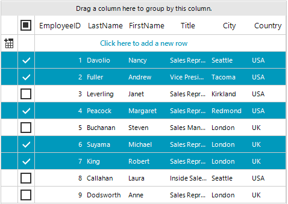
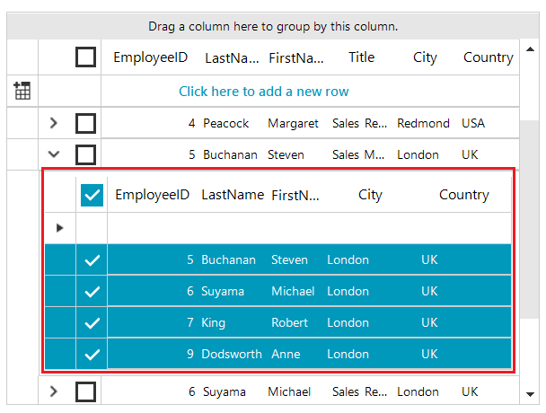

# GridViewSelectColumn

**GridViewSelectColumn** is used to mark whether a row is selected or not by displaying a checkbox for each row. It is positioned just before the first data column in **RadGridView**. Unlike other data column types, the **GridViewSelectColumn**  inherits from [GridViewColumn]() and does not bind to data. This feature extends the selection UI experience and allows the end users to select or deselect rows from the grid by using a checkbox. It is supported in grouping, paging, hierarchy mode, etc. 

#### Show GridViewSelectColumn

The **ShowSelectColumn** property indicates whether the select column is visible. The default value of this property is *false*. Also, this column is not auto generated. 

To show **GridViewSelectColumn** it is necessary to set the **ShowSelectColumn** property to *true*. 

>caption Figure 1: Show GridViewSelectColumn



{{source=..\SamplesCS\GridView\Columns\GridViewSelectColumn.cs region=ShowSelectColumn}} 
{{source=..\SamplesVB\GridView\Columns\GridViewSelectColumn.vb region=ShowSelectColumn}} 

````C#
this.radGridView1.ShowSelectColumn = true;

````
````VB.NET
Me.RadGridView1.ShowSelectColumn = True

````

{{endregion}} 


>note **GridViewSelectColumn** is only supported in GridViewSelectionMode.**FullRowSelect**. In *FullRowSelect* mode the user is able to select full rows in grid, while in *CellSelect* mode it is possible to select single cells. For more information see [Row selection]().

#### Multiple Selection

If the *MultiSelect* property is enabled, users can make a [multiple selection in RadGridView](). When using the selection UI through GridViewSelectColumn, the users will be able to select multiple rows by simply checking a chechbox. If *MultiSelect* property is *false*, the users can select only a single row/cell. 

#### Hierarchy mode

**GridViewSelectColumn** is also supported when RadGridView is bound to hierarchical data and child templates in hierarchy view are shown. In case you would like to enable this setting in hierarchy, it is necessary to set **ShowSelectColumn** to the respective child template:

>caption Figure 2: Show GridViewSelectColumn in Hierarchy



{{source=..\SamplesCS\GridView\Columns\GridViewSelectColumn.cs region=SelectColumninHierarchy}} 
{{source=..\SamplesVB\GridView\Columns\GridViewSelectColumn.vb region=SelectColumninHierarchy}} 

````C#
this.radGridView1.MasterTemplate.Templates[0].ShowSelectColumn = true;

````
````VB.NET
Me.RadGridView1.MasterTemplate.Templates(0).ShowSelectColumn = True

````

{{endregion}} 

>note This feature is also available in other functionalities that RadGridView offers such as grouping, filtering, searching, paging.

#### SelectColumnWidth

**SelectColumnWidth** property gets or sets the width of the GridViewSelectColumn.

{{source=..\SamplesCS\GridView\Columns\GridViewSelectColumn.cs region=SetSelectColumnWidth}} 
{{source=..\SamplesVB\GridView\Columns\GridViewSelectColumn.vb region=SetSelectColumnWidth}} 

````C#
this.radGridView1.TableElement.SelectColumnWidth = 50;

````
````VB.NET
Me.RadGridView1.TableElement.SelectColumnWidth = 50

````

{{endregion}} 


#### Events

Every time when а row is checked/unchecked and the selection has changed, RadGridView triggers the following events:

* **SelectionChanging**: Fires when the current selection is about to be changing. Allows to be canceled. 
* **SelectionChanged**: Fires when the current selection is changed.


# See Also
* [GridViewBrowseColumn]()

* [GridViewCalculatorColumn]()

* [GridViewCheckBoxColumn]()

* [GridViewColorColumn]()

* [GridViewComboBoxColumn]()

* [GridViewCommandColumn]()

* [GridViewDateTimeColumn]()

* [GridViewDecimalColumn]()

* [GridViewSparklineColumn]()

