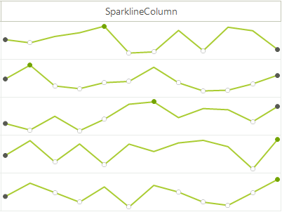
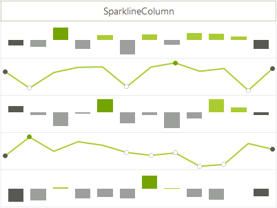

# GridViewSparklineColumn

**GridViewSparklineColumn** allows a Sparkline chart to be displayed in the **RadGridView**. **GridViewSparklineColumn** can be one of the following types: [SparkAreaSeries](), [SparkBarSeries](), [SparkLineSeries](), [SparkScatterSeries](), [SparkWinLossSeries]().



#### Add GridViewSparklineColumn to the grid.
The following code snippet demonstrates how to create and add **GridViewSparklineColumn** to **RadGridView** with some sample data added in it:

````C#
 GridViewSparklineColumn sparkLineColumn = new GridViewSparklineColumn();
 sparkLineColumn.SeriesType = SparkSeriesType.Line;
 sparkLineColumn.Name = "Line";
 sparkLineColumn.FieldName = "Line";
 sparkLineColumn.HeaderText = "SparkLineColumn";
 sparkLineColumn.ShowHighPointIndicator = true;
 sparkLineColumn.ShowFirstPointIndicator = true;
 sparkLineColumn.ShowLastPointIndicator = true;
 sparkLineColumn.ShowNegativePointIndicators = true;
 this.radGridView1.Columns.Add(sparkLineColumn);

     GridViewRowInfo row = this.radGridView1.Rows.AddNew();
     double[] values = new double[12];
     for (int i = 0; i < values.Length; i++)
     {
         values[i] = rand.Next(-100, 100);
     }
     row.Cells["Line"].Value = values;

     row = this.radGridView1.Rows.AddNew();
     values = new double[12];
     for (int i = 0; i < values.Length; i++)
     {
         values[i] = rand.Next(-100, 100);
     }
     row.Cells["Line"].Value = values;

     row = this.radGridView1.Rows.AddNew();
     values = new double[12];
     for (int i = 0; i < values.Length; i++)
     {
         values[i] = rand.Next(-100, 100);
     }
     row.Cells["Line"].Value = values;

     row = this.radGridView1.Rows.AddNew();
     values = new double[12];
     for (int i = 0; i < values.Length; i++)
     {
         values[i] = rand.Next(-100, 100);
     }
     row.Cells["Line"].Value = values;

     row = this.radGridView1.Rows.AddNew();
     values = new double[12];
     for (int i = 0; i < values.Length; i++)
     {
         values[i] = rand.Next(-100, 100);
     }
     row.Cells["Line"].Value = values;

````
````VB.NET
Dim sparkLineColumn As GridViewSparklineColumn = New GridViewSparklineColumn()
sparkLineColumn.SeriesType = SparkSeriesType.Line
sparkLineColumn.Name = "Line"
sparkLineColumn.FieldName = "Line"
sparkLineColumn.HeaderText = "SparkLineColumn"
sparkLineColumn.ShowHighPointIndicator = True
sparkLineColumn.ShowFirstPointIndicator = True
sparkLineColumn.ShowLastPointIndicator = True
sparkLineColumn.ShowNegativePointIndicators = True
RadGridView1.Columns.Add(sparkLineColumn)

Dim row As GridViewRowInfo = Me.radGridView1.Rows.AddNew()
    Dim values As Double() = New Double(11) {}
    For i As Integer = 0 To values.Length - 1
        values(i) = rand.[Next](-100, 100)
    Next
    row.Cells("Line").Value = values

    Dim values As Double() = New Double(11) {}
    For i As Integer = 0 To values.Length - 1
        values(i) = rand.[Next](-100, 100)
    Next
    row.Cells("Line").Value = values

    Dim values As Double() = New Double(11) {}
    For i As Integer = 0 To values.Length - 1
        values(i) = rand.[Next](-100, 100)
    Next
    row.Cells("Line").Value = values

    Dim values As Double() = New Double(11) {}
    For i As Integer = 0 To values.Length - 1
        values(i) = rand.[Next](-100, 100)
    Next
    row.Cells("Line").Value = values

    Dim values As Double() = New Double(11) {}
    For i As Integer = 0 To values.Length - 1
        values(i) = rand.[Next](-100, 100)
    Next
    row.Cells("Line").Value = values

````

{{endregion}} 

## SparkDataNeeded event

The **SparkDataNeeded** event can be used to dynamically populate or change data at run-time. It is fired right before creating the data points inside the sparkline element in the cell.

````C#
 private void SparkLineColumn_SparkDataNeeded(object sender, SparkDataNeededEventArgs e)
 {
     GridSparklineCellElement gridSparklineCellElement = sender as GridSparklineCellElement;
     if (gridSparklineCellElement == null)
     {
         return;
     }

     var myValues = new double[6];
     for (int i = 0; i < 6; i++)
     {
         myValues[i] = rand.Next(-100, 100);
     }

     e.Values = myValues;
 }
 
````
````VB.NET
Private Sub SparkLineColumn_SparkDataNeeded(ByVal sender As Object, ByVal e As SparkDataNeededEventArgs)
    Dim gridSparklineCellElement As GridSparklineCellElement = TryCast(sender, GridSparklineCellElement)

    If gridSparklineCellElement Is Nothing Then
        Return
    End If
    Dim myValues = New Double(5) {}

    For i As Integer = 0 To 6 - 1
        myValues(i) = rand.[Next](-100, 100)
    Next
    e.Values = myValues
End Sub

````

{{endregion}} 

## Binding GridViewSparklineColumn

You can bind the **GridViewSparklineColumn** to any IEnumerable collection of numeric data types. To do this, you should set the **FieldName** of the **GridViewSparklineColumn** to be the same as the name of the appopriate existing column in the data source. The example below binds the grid to DataTable via the **DataSource** property. To prevent the grid from traversing all data fields in that collection, I set the **GridViewTemplate.AutoGenerateColumns** property to *False*. 

````C#
DataTable dt = new DataTable();
dt.Columns.Add("Id",typeof(int));
dt.Columns.Add("Name",typeof(string));
dt.Columns.Add("Points", typeof(double[]));

Random rand = new Random();
for (int i = 0; i < 5; i++)
{
    double[] pointsValues = new double[12];
    for (int j = 0; j < pointsValues.Length; j++)
    {
        pointsValues[j]=rand.Next(-100, 100);
    }
   
    dt.Rows.Add(i,"Row"+i, pointsValues);
}

this.radGridView1.MasterTemplate.AutoGenerateColumns = false;
this.radGridView1.DataSource = dt;

GridViewSparklineColumn sparkLineColumn = new GridViewSparklineColumn("Points");
sparkLineColumn.SeriesType = SparkSeriesType.Line;
sparkLineColumn.FieldName = "Points";
sparkLineColumn.HeaderText = "Points";
this.radGridView1.Columns.Add(sparkLineColumn);

````
````VB.NET

    Dim dt As DataTable = New DataTable()
    dt.Columns.Add("Id", GetType(Integer))
    dt.Columns.Add("Name", GetType(String))
    dt.Columns.Add("Points", GetType(Double()))

    Dim rand As Random = New Random()
    For i As Integer = 0 To 5 - 1
        Dim pointsValues As Double() = New Double(11) {}

        For j As Integer = 0 To pointsValues.Length - 1
            pointsValues(j) = rand.[Next](-100, 100)
        Next

        dt.Rows.Add(i, "Row" & i, pointsValues)
    Next

    Me.RadGridView1.MasterTemplate.AutoGenerateColumns = False
    Me.RadGridView1.DataSource = dt
    Dim sparkLineColumn As GridViewSparklineColumn = New GridViewSparklineColumn("Points")
    sparkLineColumn.SeriesType = SparkSeriesType.Line
    sparkLineColumn.FieldName = "Points"
    sparkLineColumn.HeaderText = "Points"
    Me.RadGridView1.Columns.Add(sparkLineColumn)

````

{{endregion}} 


## Customize GridViewSparklineColumn

**GridViewSparklineColumn** can be customized by making use of **CellFormatting** event. Here is an example how to make the even rows in **GridViewSparklineColumn** to desplay bar series, and the odd rows to display line series. Due to the UI Virtualization, an `if-else` statement is used to reset the series.



````C#
private void RadGridView1_CellFormatting(object sender, CellFormattingEventArgs e)
{
    GridViewSparklineColumn sparklineColumn = e.CellElement.ColumnInfo as GridViewSparklineColumn;
    if (sparklineColumn != null)
    {
        GridSparklineCellElement sparklineCellElement = sender as GridSparklineCellElement;
        if (sparklineCellElement == null || sparklineCellElement.SparklineElement.Series == null)
        {
            return;
        }

        SparkCartesianSeries series = null;
        if (e.CellElement.RowIndex % 2 == 0)
        {
            series = new SparkBarSeries();
        }
        else
        {
            series = new SparkLineSeries();
        }

        series.ShowFirstPointIndicator = sparklineColumn.ShowFirstPointIndicator;
        series.ShowLastPointIndicator = sparklineCellElement.SparklineElement.Series.ShowLastPointIndicator;
        series.ShowHighPointIndicator = sparklineCellElement.SparklineElement.Series.ShowHighPointIndicator;
        series.ShowLowPointIndicator = sparklineCellElement.SparklineElement.Series.ShowLowPointIndicator;
        series.ShowNegativePointIndicators = sparklineCellElement.SparklineElement.Series.ShowNegativePointIndicators;

        SparkDataPoint[] values = new SparkDataPoint[sparklineCellElement.SparklineElement.Series.DataPoints.Count];
        sparklineCellElement.SparklineElement.Series.DataPoints.CopyTo(values, 0);
        sparklineCellElement.SparklineElement.Series.DataPoints.Clear();

        series.DataPoints.AddRange(values);
        sparklineCellElement.SparklineElement.Series = series;
    }
}

````
````VB.NET
Private Sub RadGridView1_CellFormatting(ByVal sender As Object, ByVal e As CellFormattingEventArgs)
    Dim sparklineColumn As GridViewSparklineColumn = TryCast(e.CellElement.ColumnInfo, GridViewSparklineColumn)

    If sparklineColumn IsNot Nothing Then
        Dim sparklineCellElement As GridSparklineCellElement = TryCast(sender, GridSparklineCellElement)

        If sparklineCellElement Is Nothing OrElse sparklineCellElement.SparklineElement.Series Is Nothing Then
            Return
        End If

        Dim series As SparkCartesianSeries = Nothing

        If e.CellElement.RowIndex Mod 2 = 0 Then
            series = New SparkBarSeries()
        Else
            series = New SparkLineSeries()
        End If

        series.ShowFirstPointIndicator = sparklineColumn.ShowFirstPointIndicator
        series.ShowLastPointIndicator = sparklineCellElement.SparklineElement.Series.ShowLastPointIndicator
        series.ShowHighPointIndicator = sparklineCellElement.SparklineElement.Series.ShowHighPointIndicator
        series.ShowLowPointIndicator = sparklineCellElement.SparklineElement.Series.ShowLowPointIndicator
        series.ShowNegativePointIndicators = sparklineCellElement.SparklineElement.Series.ShowNegativePointIndicators
        Dim values As SparkDataPoint() = New SparkDataPoint(sparklineCellElement.SparklineElement.Series.DataPoints.Count - 1) {}
        sparklineCellElement.SparklineElement.Series.DataPoints.CopyTo(values, 0)
        sparklineCellElement.SparklineElement.Series.DataPoints.Clear()
        series.DataPoints.AddRange(values)
        sparklineCellElement.SparklineElement.Series = series
    End If
End Sub

````

{{endregion}} 

## GridViewSparklineColumn's Properties 

|Property|Description|
|----|----|
|**SeriesType**|Gets or sets a value indicating what is the type of the generated series.|
|**ShowTooltip**|Gets or sets a value whether tooltips on the point markers will be shown.|
|**ShowMarkers**|Gets or sets a value indicating whether the point markers will be shown.|
|**ShowHighPointIndicator**|Gets or sets a value indicating whether the high point marker will be shown.|
|**ShowLowPointIndicator**|Gets or sets a value indicating whether the low point marker will be shown.|
|**ShowFirstPointIndicator**|Gets or sets a value indicating whether the first point marker will be shown.|
|**ShowLastPointIndicator**|Gets or sets a value indicating whether the last point marker will be shown.|
|**ShowNegativePointIndicators**|Gets or sets a value indicating whether the negative points marker will be shown.|
|**AllowSearching**|Gets or sets a value indicating whether the user can search by this column.|
|**AllowFiltering**|Gets or sets a value indicating whether the user can filter by this column.|


## GridViewSparklineColumn's Events

|Event|Description|
|----|----|
|[PaintSparkFill]()|Fires when a spark fill will be painted using a specific solid brush.|
|[PaintSparkStroke]()|Fires when a spark line will be painted using a specific Pen.|
|**SparkDataNeeded**|Fires before adding data points to the SparkSeries. It is possible to cancel the event and bind the series.|
|**SparklineElementExporting**|Fires while exporting or printing the sparkline cell element, allows customization of the series.|

