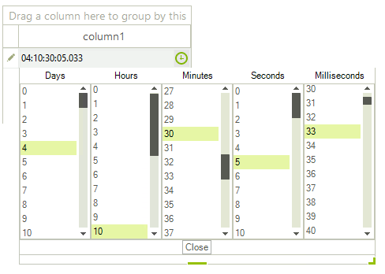
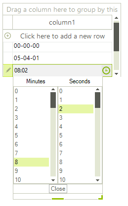

# GridViewTimeSpanColumn

**GridViewTimeSpanColumn** provides data entry and formatting for *TimeSpan* data types. You may enter the TimeSpan value directly into the editor or select the different parts for the TimeSpan value in the drop down. 

>caption Figure 1: GridViewTimeSpanColumn in edit mode



The __FormatString__ property sets the format of the TimeSpan when the cell is not currently being edited. The **Format** property is used to format the value once the user clicks on the cell to invoke the editor. The activated editor takes into consideration the applied **Format** and thus, only the specified parts of the TimeSpan will be loaded when the drop down editor opens.

#### Formatting the TimeSpan.

{{source=..\SamplesCS\GridView\Columns\GridViewTimeSpanColumn1.cs region=addTimeSpanColumn}} 
{{source=..\SamplesVB\GridView\Columns\GridViewTimeSpanColumn1.vb region=addTimeSpanColumn}} 

````C#
GridViewTimeSpanColumn gridViewTimeSpanColumn1 = new GridViewTimeSpanColumn();
gridViewTimeSpanColumn1.FormatString = "hh-mm-ss";
gridViewTimeSpanColumn1.Format = "mm:ss";
this.radGridView1.Columns.Add(gridViewTimeSpanColumn1);

````
````VB.NET
Dim gridViewTimeSpanColumn1 As GridViewTimeSpanColumn = New GridViewTimeSpanColumn()
gridViewTimeSpanColumn1.FormatString = "hh-mm-ss"
gridViewTimeSpanColumn1.Format = "mm:ss"
Me.RadGridView1.Columns.Add(gridViewTimeSpanColumn1)

````

{{endregion}} 

>caption Figure 2: Formatted editor's value



There are two ways to change the TimeSpan format when the cell enters edit mode - either by setting the above mentioned **Format** property of the column or by handling the RadGridView.**CellEditorInitialized** event and applying the desired format to the **GridTimeSpanPickerEditor**. It is fired when the initialization of an editor is performed:  

{{source=..\SamplesCS\GridView\Columns\GridViewTimeSpanColumn1.cs region=changeEditorFormat}} 
{{source=..\SamplesVB\GridView\Columns\GridViewTimeSpanColumn1.vb region=changeEditorFormat}} 

````C#
        
private void radGridView1_CellEditorInitialized(object sender, GridViewCellEventArgs e)
{
    GridTimeSpanPickerEditor editor = e.ActiveEditor as GridTimeSpanPickerEditor;
    if (editor != null)
    {
        RadTimeSpanPickerElement element = editor.EditorElement as RadTimeSpanPickerElement;
        element.Format = "mm:ss";
    }
}

````
````VB.NET
Private Sub radGridView1_CellEditorInitialized(ByVal sender As Object, ByVal e As GridViewCellEventArgs)
    Dim editor As GridTimeSpanPickerEditor = TryCast(e.ActiveEditor, GridTimeSpanPickerEditor)
    If editor IsNot Nothing Then
        Dim element As RadTimeSpanPickerElement = TryCast(editor.EditorElement, RadTimeSpanPickerElement)
        element.Format = "mm:ss"
    End If
End Sub

````

{{endregion}} 

>important If we do not use the **CellEditorInitialized** event, but the **CellBeginEdit** event (which is fired before **CellEditorInitialized**), our **Format** setting will be overridden by the initialization of the editor. 

## EditorType

The **EditorType** value indicating how the users will edit the TimeSpan value. It could be set to three values:       

* **Mask** - The value will be edited in masked edit box.
* **Popup** - The value will be edited only in pop-up.
* **Combined** - The value is modified both in masked edit box and pop-up.

>note The default value is *TimeSpanEditMode.Combined*.

## Properties

|Property|Description|
|----|----|
|**DataType**|Gets or sets the data type of the column. By default it is *TimeSpan*.|
|**ExcelExportType**|Gets or sets the type of the excel export.|
|**Format**|Gets or sets the format of the TimeSpan displayed in the editor. The default value is "dd:hh:mm:ss.fff".|
|**Minimum**|Gets or sets the minimum value. The default value is "00:00:00".|
|**Maximum**|Gets or sets the maximum value. The default value is "100:00:00".|
|**EditMode**|Gets or sets a value indicating how the users will edit the TimeSpan value.|
|**DaysStep**|Gets or sets the days step used when modifying the value.|
|**HoursStep**|Gets or sets the hours step used when modifying the value.|
|**MinutesStep**|Gets or sets the minutes step used when modifying the value.|
|**SecondsStep**|Gets or sets the seconds step used when modifying the value.|
|**MillisecondsStep**|Gets or sets the milliseconds step used when modifying the value.|
            
# See Also
* [GridViewBrowseColumn]()

* [GridViewCalculatorColumn]()

* [GridViewCheckBoxColumn]()

* [GridViewColorColumn]()

* [GridViewComboBoxColumn]()

* [GridViewCommandColumn]()

* [GridViewDecimalColumn]()

* [GridViewHyperlinkColumn]()

* [GridViewSparklineColumn]()

