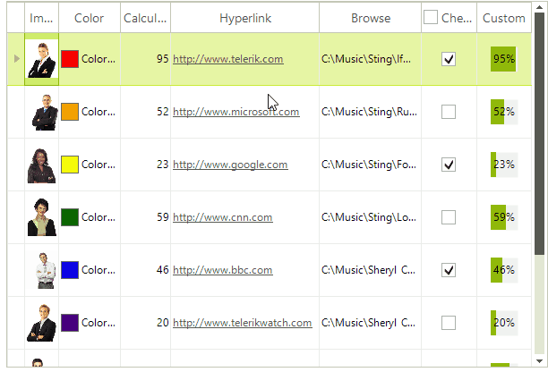

# Resizing columns programmatically

You can control if and how users can resize the Grid columns. You can also set the column size through code.

## Resizing columns manually

By default, the columns inside **RadGridView** are resizable. The users can easily change the column's width by positioning the mouse over the column's vertical grid line and dragging it until they achieve the desired size.



## Disabling manual resizing

There are two ways to disable resizing of columns in the user interface:

* To restrict the user from resizing all columns, set the __AllowColumnResize__ property of **RadGridView** to `false`:

{{source=..\SamplesCS\GridView\Columns\ResizingColumns.cs region=AllowColumnResize}} 
{{source=..\SamplesVB\GridView\Columns\ResizingColumns.vb region=AllowColumnResize}} 

````C#
this.radGridView1.AllowColumnResize = false;

````
````VB.NET
Me.RadGridView1.AllowColumnResize = False

````

{{endregion}}

* To restrict the user from resizing a particular column, set the __AllowResize__ property of the column to `false`:

{{source=..\SamplesCS\GridView\Columns\ResizingColumns.cs region=AllowResize}} 
{{source=..\SamplesVB\GridView\Columns\ResizingColumns.vb region=AllowResize}} 

````C#
this.radGridView1.Columns["Photo"].AllowResize = false;

````
````VB.NET
Me.RadGridView1.Columns("Photo").AllowResize = False

````

{{endregion}}

## Programmatically resizing columns

You can set the column width individually for each column. Note that the visible width will always include some data even if you set the width to very small values. To resize the columns programmatically, you can use the __Width__ property. For example: 

{{source=..\SamplesCS\GridView\Columns\ResizingColumns.cs region=resizingColumn}} 
{{source=..\SamplesVB\GridView\Columns\ResizingColumns.vb region=resizingColumn}} 

````C#
this.radGridView1.Columns["Photo"].Width = 100;

````
````VB.NET
Me.RadGridView1.Columns("Photo").Width = 100

````

{{endregion}}

## Setting size limits

You can restrict the possible values of the __Width__ property by setting the __MinWidth__ and __MaxWidth__ properties. The __MinWidth__ property sets a limit on how narrow the column can be. The __MaxWidth__ property determines how wide the column can get.

>note The **DpiScale** property gives the effective Dpi scaling of the control. The **Width** property of the columns returns a value considering the **DpiScale**.

## Column Auto-Sizing

There are two ways to auto size the columns: **AutoSizeColumnsMode** and **Best fit**.

### AutoSizeColumnsMode

Columns can automatically fill the entire width of the grid. Just set the __AutoSizeColumnsMode__ property of the desired template to GridViewAutoSizeColumnsMode.*Fill*.

### Best fit

You can configure the column width to fit the content by using the GridViewTemplate.__BestFitColumns__ or GridViewDataColumn.__BestFit__ methods. In these modes, the algorithm attempts to fit the header text and column data for all visible rows.

>note Before using one of the best fit methods, make sure that the grid is populated with data. The column width is calculated based on content in the data rows.

The GridViewTemplate.**BestFitColumns** method offers two overloads:

* **BestFitColumns()**: Widens / shrinks all columns based on the space required by the text in the columns.

* **BestFitColumns(BestFitColumnMode.)**: the **BestFitColumnMode** controls which cells participate in the calculations for the space required to fit the text. These are the available modes:

  * BestFitColumnMode.__None__ - The column's width does not adjust automatically.

  * BestFitColumnMode.__AllCells__ - The column's width adjusts to fit the contents of all cells in the control.

  * BestFitColumnMode.__DisplayedDataCells__ - The column's width adjusts to fit the contents of the displayed data cells.

  * BestFitColumnMode.__HeaderCells__ - The column's width adjusts to fit the contents of the header cell.

  * BestFitColumnMode.__FilterCells__ - The column's width adjusts to fit the contents of the filter cell.

  * BestFitColumnMode.__SummaryRowCells__ - The column's width adjusts to fit the contents of the summary row cell.

  * BestFitColumnMode.__SystemCells__ - The column's width adjusts to fit the contents of the system cells.

  * BestFitColumnMode.__DisplayedCells__ - The column's width adjusts to fit the contents of the displayed cells.

You can customize the execution of the algorithm for a concrete column by setting the __AutoSizeMode__ property on the desired column.

When you configure the desired best fit method, users can execute the best fit operation by:

* using the context menu of the header cell

* double-clicking the left or right header edge 


## Resizing events

When the user resizes the column, the __ColumnWidthChanging__ event is fired, and if it is not canceled, the __ColumnWidthChanged__ event fires after the resize operation is completed.

# See Also
* [Accessing and Iterating through Columns]()

* [Calculated Columns (Column Expressions)]()

* [Converting Data Types]()

* [Data Formatting]()

* [Generating Columns]()

* [GridViewColumn]()

* [GridViewDataColumn]()

* [Mixing BestFit and Fill Modes for the GridView's Columns]()

