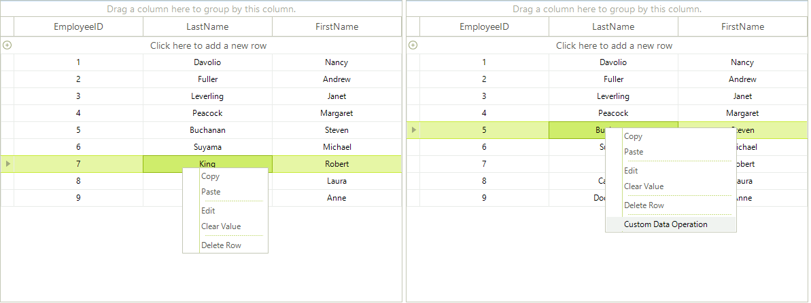

# Modifying the Default Context Menu

The default __RadGridView context__ menu can be customized in the ContextMenuOpening event handler.

## Removing an item from default RadGridView context menu:

In order to remove an item, you need to make a loop iterating the __e.ContextMenu.Items__ and check if the __e.ContextMenu.Items[index].Text__ is equal to the text of the menu item that you want to hide. If so, just set the __Visibility__ of the menu item to *Collapsed*:

{{source=..\SamplesCS\GridView\ContextMenus\ModifingTheDefaultContextMenu.cs region=removeContextMenuItem}} 
{{source=..\SamplesVB\GridView\ContextMenus\ModifingTheDefaultContextMenu.vb region=removeContextMenuItem}} 

````C#
void radGridView1_ContextMenuOpening(object sender, Telerik.WinControls.UI.ContextMenuOpeningEventArgs e)
{
    for (int i = 0; i < e.ContextMenu.Items.Count; i++)
    {
        if (e.ContextMenu.Items[i].Text == "Conditional Formatting")
        {
            // hide the Conditional Formatting option from the header row context menu
            e.ContextMenu.Items[i].Visibility = Telerik.WinControls.ElementVisibility.Collapsed;
            // hide the separator below the CF option
            e.ContextMenu.Items[i + 1].Visibility = Telerik.WinControls.ElementVisibility.Collapsed;
        }
    }
}

````
````VB.NET
Private Sub RadGridView1_ContextMenuOpening(ByVal sender As Object, ByVal e As Telerik.WinControls.UI.ContextMenuOpeningEventArgs) Handles RadGridView1.ContextMenuOpening
    Dim i As Integer = 0
    Do While i < e.ContextMenu.Items.Count
        If e.ContextMenu.Items(i).Text = "Conditional Formatting" Then
            ' hide the Conditional Formatting option from the header row context menu
            e.ContextMenu.Items(i).Visibility = Telerik.WinControls.ElementVisibility.Collapsed
            ' hide the separator below the CF option
            e.ContextMenu.Items(i + 1).Visibility = Telerik.WinControls.ElementVisibility.Collapsed
        End If
        i += 1
    Loop
End Sub

````

{{endregion}} 

>note If your grid is localized you can get the item text from the localization provider - `if (e.ContextMenu.Items[i].Text == RadGridLocalizationProvider.CurrentProvider.GetLocalizedString(RadGridStringId.ConditionalFormattingMenuItem))'

## Adding menu items to the default RadGridView context menu

In order to add custom menu items to the default context menu, *you should create menu item instances in the ContextMenuOpening event handler* and add them to the __e.ContextMenu.Items:__

{{source=..\SamplesCS\GridView\ContextMenus\ModifingTheDefaultContextMenu.cs region=addContextMenuOption}} 
{{source=..\SamplesVB\GridView\ContextMenus\ModifingTheDefaultContextMenu.vb region=addContextMenuOption}} 

````C#
void radGridView1_ContextMenuOpening1(object sender, Telerik.WinControls.UI.ContextMenuOpeningEventArgs e)
{
    RadMenuItem customMenuItem = new RadMenuItem();
    customMenuItem.Text = "Custom Data Operation";
    RadMenuSeparatorItem separator = new RadMenuSeparatorItem();
    e.ContextMenu.Items.Add(separator);
    e.ContextMenu.Items.Add(customMenuItem);
}

````
````VB.NET
Private Sub RadGridView1_ContextMenuOpening1(ByVal sender As Object, ByVal e As Telerik.WinControls.UI.ContextMenuOpeningEventArgs) Handles RadGridView1.ContextMenuOpening
    Dim customMenuItem As RadMenuItem = New RadMenuItem()
    customMenuItem.Text = "Custom Data Operation"
    Dim separator As RadMenuSeparatorItem = New RadMenuSeparatorItem()
    e.ContextMenu.Items.Add(separator)
    e.ContextMenu.Items.Add(customMenuItem)
End Sub

````

{{endregion}} 

>note You can subscribe to the **Click** event of the newly added menu items and thus execute the desired action when a **RadMenuItem** is clicked.


The result of combining the approaches from this article is shown on the screenshot below:


# See Also
* [Conditional Custom Context Menus]()

* [Custom Context Menus]()

