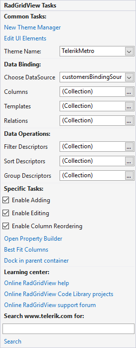

# Smart Tag

The Smart Tag of RadGridView lets you quickly access common tasks involved with building RadGridView elements and customizing appearance through themes.

>caption Figure 1: The Smart Tag of RadGridView.

* __Common Tasks__
    
    - __New Theme Manager__: Adds a new __RadThemeManager__ component to the form.

    - __Edit UI elements__: Opens a dialog that displays the __Element Hierarchy Editor__. This editor lets you browse all the elements in the control, including the RadGridView itself and elements that make up the columns, rows, headers and other parts of the grid. 

    - __Theme Name__: Select a theme name from the drop down list of themes available for that control. Selecting a theme allows you to change all aspects of the controls visual style at one time. 

* __Data Binding__

    - __Choose DataSource__: Allows you to select a DataSource in order to populate the grid.

    - __Columns__: Opens a dialog that displays __GridViewDataColumn Collection Editor__. This editor lets you add different kind of columns to your table.

    - __Templates__: Contains a collection of GridViewTemplates.

    - __Relations__: Lets you specify the relations between columns. 

* __Data Operations__

    - __Filter Descriptors__: Opens a dialog __FilterDescriptor Collection Editor__, and allows you to specify the rules for filtering.

    - __Sort Descriptors__: Opens a dialog __SortDescriptor Collection Editor__, and allows you to specify the rules for sorting.

    - __Group Descriptors__: Opens a dialog __GroupDescriptor Collection Editor__, and allows you to specify the rules for grouping.

* __Specific Tasks__

    - __Enable Adding__: Allows the user to add new rows.

    - __Enable Editing__: Allows the user to perform edit operations in RadGridView.

    - __Enable Column Reordering__: Lets the user to reorder the columns by his discretion.

    - __Open__ [Property Builder](): Use the Property Builder to quickly create and arrange grid structure and appearance.

    - __Best Fit Columns__: Sets the size of the columns to best fit to their content.

    - __Dock in parent container__: Docks the whole grid to its parent container.

* __Learning Center__: Navigate to the Telerik help, code library projects or support forum.

* __Search__: Search the Telerik site for a given string. 

# See Also
* [Property Builder]()

