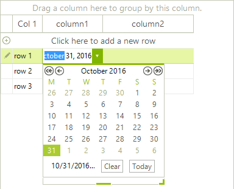
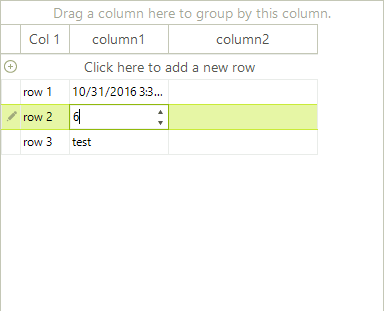

# Change the active editor depending on the cell value type.

Common case is to have a single column (for example a GridViewTextBoxColumn) with different values in the rows. Naturally the user will want to edit the respective values in appropriate editors. For example if you have a GridViewTextBoxColumn with tree rows where the first row has a DateTime value, the second has decimal value and the third has text value, it would be nice for the end user to edit the date in a date time editor, the decimal value in a numeric editor and the text in a text editor. This article is going to show how this behavior can be achieved in few easy steps.
        

First we can set up the grid with some columns and rows, this will allow us to observe the editor behavior later. Just drop a RadGridView in a blank form and then use the following code to initialize the grid. At the end, subscribe to the __EditorRequired__ event, which is triggered when a cell needs an editor:

{{source=..\SamplesCS\GridView\Editors\How-To\ChangeTheActiveEditorDependingOnTheCellValueType.cs region=FormLoad}} 
{{source=..\SamplesVB\GridView\Editors\How-To\ChangeTheActiveEditorDependingOnTheCellValueType.vb region=FormLoad}} 

````C#
      
private void ChangeTheActiveEditorDependingOnTheCellValueType_Load(object sender, EventArgs e)
{
    GridViewTextBoxColumn gridViewTextBoxColumn1 = new GridViewTextBoxColumn();
    GridViewTextBoxColumn gridViewTextBoxColumn2 = new GridViewTextBoxColumn();
    gridViewTextBoxColumn1.HeaderText = "column1";
    gridViewTextBoxColumn1.Name = "column1";
    gridViewTextBoxColumn1.Width = 100;
    gridViewTextBoxColumn2.HeaderText = "column2";
    gridViewTextBoxColumn2.Name = "column2";
    gridViewTextBoxColumn2.Width = 150;
    this.radGridView1.MasterTemplate.Columns.AddRange(new GridViewDataColumn[]
    {
        gridViewTextBoxColumn1,
        gridViewTextBoxColumn2
    });
    this.radGridView1.Rows.Add("row 1", DateTime.Now.ToString());
    this.radGridView1.Rows.Add("row 2", "6");
    this.radGridView1.Rows.Add("row 3", "test");
    this.radGridView1.EditorRequired += radGridView1_EditorRequired;
}

````
````VB.NET
Private Sub Form1_Load(sender As Object, e As EventArgs) Handles MyBase.Load
    Dim gridViewTextBoxColumn1 As New GridViewTextBoxColumn()
    Dim gridViewTextBoxColumn2 As New GridViewTextBoxColumn()
    gridViewTextBoxColumn1.HeaderText = "column1"
    gridViewTextBoxColumn1.Name = "column1"
    gridViewTextBoxColumn1.Width = 100
    gridViewTextBoxColumn2.HeaderText = "column2"
    gridViewTextBoxColumn2.Name = "column2"
    gridViewTextBoxColumn2.Width = 150
    Me.RadGridView1.MasterTemplate.Columns.AddRange(New GridViewDataColumn() {gridViewTextBoxColumn1, gridViewTextBoxColumn2})
    Me.RadGridView1.Rows.Add("row 1", DateTime.Now.ToString())
    Me.RadGridView1.Rows.Add("row 2", "7")
    Me.RadGridView1.Rows.Add("row 3", "test")
    AddHandler RadGridView1.EditorRequired, AddressOf radGridView1_EditorRequired
End Sub

````

{{endregion}} 

Now we just need to match the value with the appropriate type and show the corresponding editor. We can do that with the following __EditorRequired__ event handler:

{{source=..\SamplesCS\GridView\Editors\How-To\ChangeTheActiveEditorDependingOnTheCellValueType.cs region=EditorRequired}} 
{{source=..\SamplesVB\GridView\Editors\How-To\ChangeTheActiveEditorDependingOnTheCellValueType.vb region=EditorRequired}} 

````C#
void radGridView1_EditorRequired(object sender, EditorRequiredEventArgs e)
{
    DateTime date;
    if (DateTime.TryParse(radGridView1.CurrentCell.Value.ToString(), out date))
    {
        e.EditorType = typeof(RadDateTimeEditor);
        return;
    }
    int i = 0;
    if (int.TryParse(radGridView1.CurrentCell.Value.ToString(), out i))
    {
        e.EditorType = typeof(GridSpinEditor);
        return;
    }
    if (radGridView1.CurrentCell.Value is string)
    {
        e.EditorType = typeof(RadTextBoxEditor);
        return;
    }
}

````
````VB.NET
Private Sub radGridView1_EditorRequired(sender As Object, e As EditorRequiredEventArgs)
    Dim [date] As DateTime
    If DateTime.TryParse(RadGridView1.CurrentCell.Value.ToString(), [date]) Then
        e.EditorType = GetType(RadDateTimeEditor)
        Return
    End If
    Dim i As Integer = 0
    If Integer.TryParse(RadGridView1.CurrentCell.Value.ToString(), i) Then
        e.EditorType = GetType(GridSpinEditor)
        Return
    End If
    If TypeOf RadGridView1.CurrentCell.Value Is String Then
        e.EditorType = GetType(RadTextBoxEditor)
        Return
    End If
End Sub

````

{{endregion}} 

The result is that the end user can edit the cells with the appropriate for their values editor:




# See Also
* [Allow end-users to add items to DropDownListEditor]()

