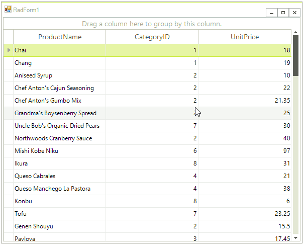
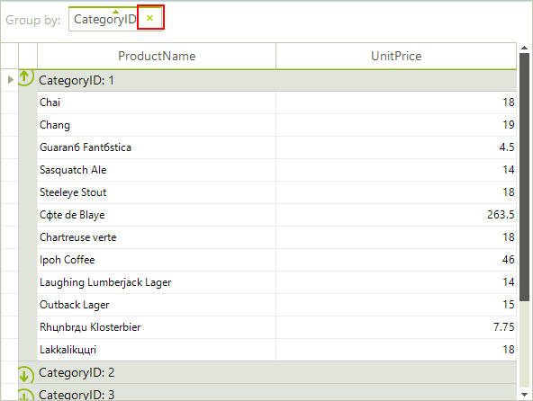
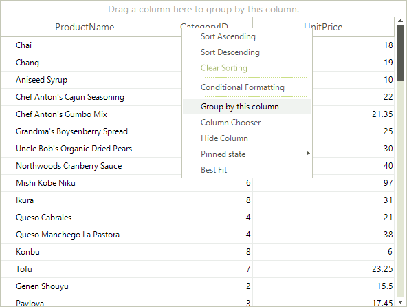
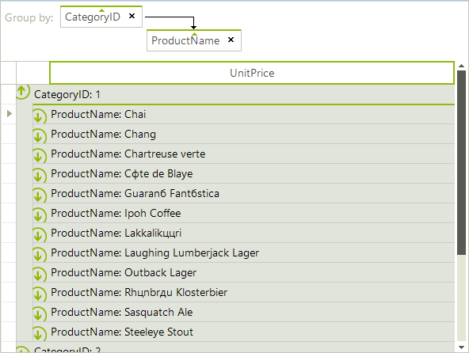
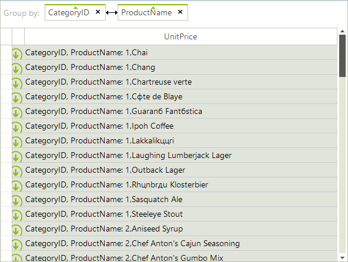

# Grouping

The end-user can drag column headings to the grouping panel at the top of the grid to group by the column:

To un-group, click the close button of the group header button:

The user can also right-click a column and select __Group by this Column__ from the context menu:

Multiple levels of grouping can be created by dragging additional column names to the grouping panel. Column names can be rearranged within the panel by dragging. In the screenshot below the top level grouping is by `CategoryID` and the second by `ProductName`.

Multiple groups can be created on the same level as shown in the example below:

# See Also
* [Column Chooser]()

* [Editing Behavior]()

* [Filtering]()

* [Keyboard Support]()

* [Printing Support]()

* [Reordering Rows]()

* [Resizing Columns]()

* [Scrolling Support]()

