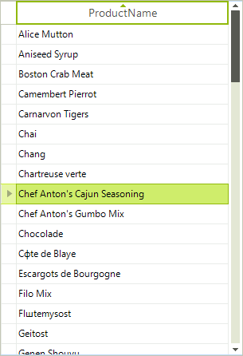
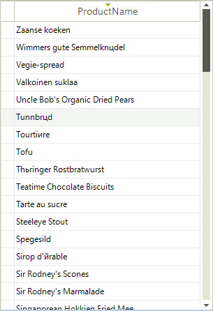
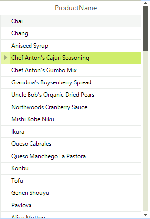
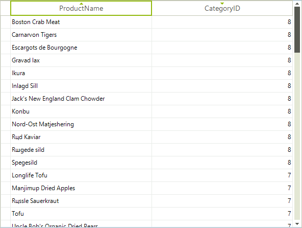
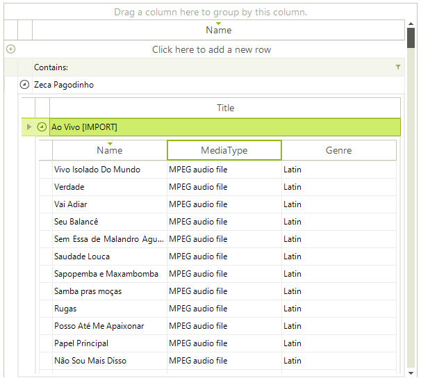
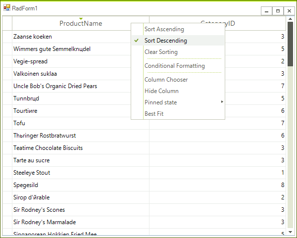

# Sorting

## Single Column Sorting

By default RadGridView allows you to sort by any column. The end-user should click on the header of the desired column to toggle between the sorting modes:

* Clicking the column header sorts by that column. The column header displays an upward pointing arrow.

* Clicking the header for a second time sorts by that column in descending order. The column header displays a downward pointing arrow.

* "Clear Sorting" from the context menu returns to a natural sort (i.e. no sorting). No arrow is displayed on the column header.

The screenshots below shows sorting by the "ProductName" column:

| Ascending | Descending | Natural Sort (Unsorted) |
| ------ | ------ | ------ |
||||

## Multiple Column Sorting

By default, clicking on a column triggers the sorting operation for that column prevents the other columns from being sorted. By holding down the __Shift__ key the user can retain the sort for an existing column and the headers of other columns to add additional sorting. The screenshot below shows categories in the right-most column sorted in descending order. The products in the left most column are sorted in ascending order. Notice that the products are sorted within the categories, i.e. with "Boston Crab Meat" the first item within category id "8" and "Spegesild" that last item within category "8".

## Sorting in Hierarchical Tables

The default behavior of the grid is to allow all views of the data to be sorted, including the master grid and all child grid views. Sorting properties for the grid and each of the templates allows sorting for each view to be enabled independently. The example below shows the master grid view of categories "Category Name" column sorted in descending order and the child view of products "Product Name" column sorted in ascending order.

## Sorting Context Menus

Sorting can be invoked through right clicking the column heading to display the context menu. The menu will allow you to choose from __Sort Ascending__, __Sort Descending__ and __Clear Sorting__.

# See Also
* [Column Chooser]()

* [Editing Behavior]()

* [Filtering]()

* [Grouping]()

* [Keyboard Support]()

* [Printing Support]()

* [Reordering Rows]()

* [Resizing Columns]()

