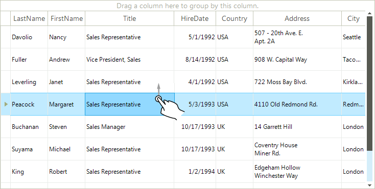
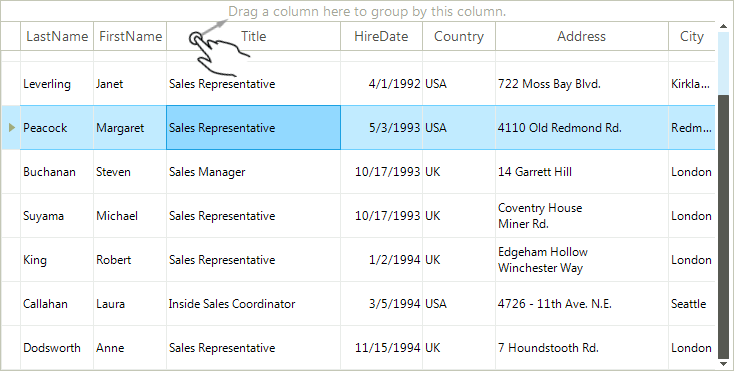
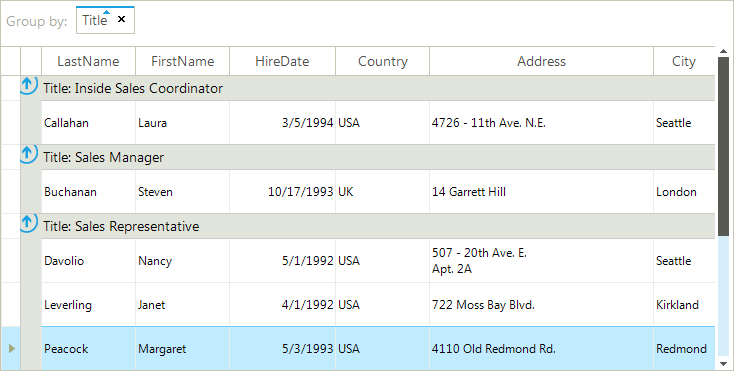
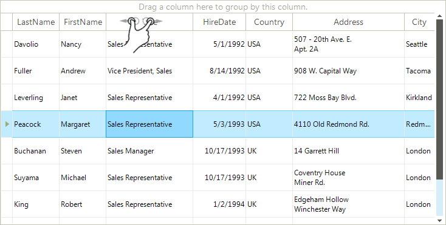
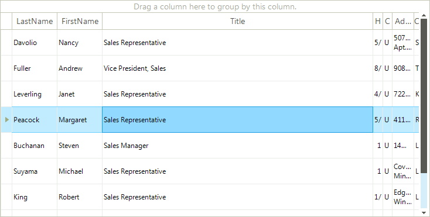
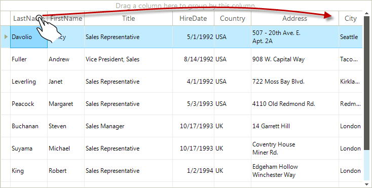
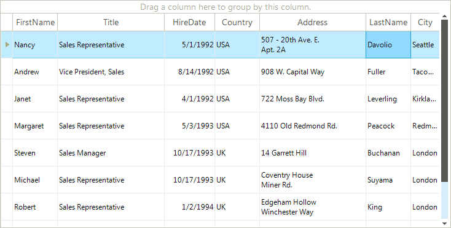
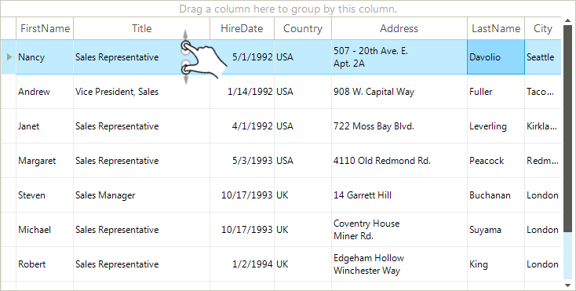
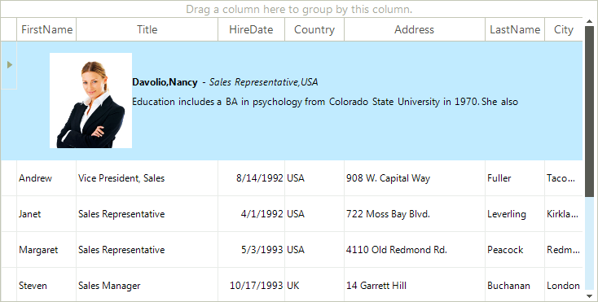

# Touch Support

RadGridView supports the following functionalities via touch interface:

## Scrolling

To scroll the control simply drag the whole control to the desired location (left, right, up, down).

Here is the result of scrolling the control down:

## Grouping

To group the grid according to some column, just drag the desired column title to the "*Drag a column here to group by this column*" section above the header area.

And the grid is grouped:

## Column Resize

Resizing the columns is achieved by the zoom gesture applied to the desired column title.

And the result is:

## Column Reorder

In order to reorder the columns, just drag the desired column title to its new location:

Here you can see the dragged "*Picture*" column from the left of the control to the right of it:

## Row Resize

Resizing the row is achieved by the zoom gesture applied to the desired row.

And the result is:

## See Also

 * [Windows Touch Gestures](http://msdn.microsoft.com/en-us/library/windows/desktop/dd940543(v=vs.85).aspx)
