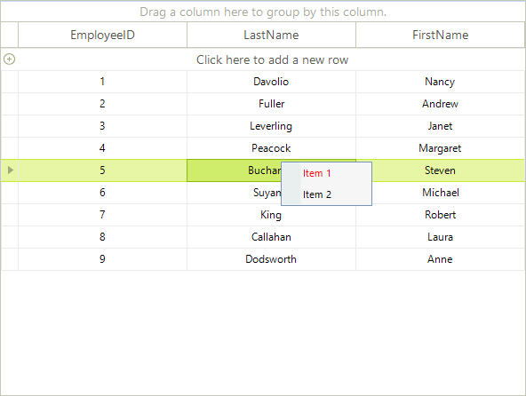

# Custom Context Menus

__RadGridView__ provides a straightforward way to use custom context menus, instead of the default one. This context menu will appear every time the user right-clicks the __RadGridView__, regardless of the element of the control they click.

>caption Figure 1: Custom Context Menu.

Start by creating the context menu, initializing its items, and subscribing for the events that you want to handle to achieve the desired behavior. Note: You will need Telerik.WinControls.UI namespace added to your "Using" (C#) or "Imports" (VB).

#### Setup the Context Menu

<snippet id='gridview-customcontextmenus-creatingcontextmenu-cs' />
<snippet id='gridview-customcontextmenus-creatingcontextmenu-vb' />

Once the menu object has been initialized and populated with menu items, it is ready to be attached to the __RadGridView__. To do that, subscribe to the __ContextMenuOpening__ event and set the context menu to be displayed:

#### ContextMenuOpening Event

<snippet id='gridview-customcontextmenus-changethecontextmenu-cs' />
<snippet id='gridview-customcontextmenus-changethecontextmenu-vb' />

# See Also

* [Conditional Custom Context Menus]()

* [Modifying the Default Context Menu]()

