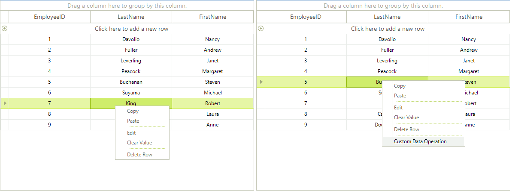

# Modifying the Default Context Menu

The default __RadGridView context__ menu can be customized in the ContextMenuOpening event handler.

## Removing an item from default RadGridView context menu:

In order to remove an item, you need to make a loop iterating the __e.ContextMenu.Items__ and check if the __e.ContextMenu.Items[index].Text__ is equal to the text of the menu item that you want to hide. If so, just set the __Visibility__ of the menu item to *Collapsed*:

<snippet id='gridview-modifingthedefaultcontextmenu-removecontextmenuitem-cs' />
<snippet id='gridview-modifingthedefaultcontextmenu-removecontextmenuitem-vb' />

>note If your grid is localized you can get the item text from the localization provider - `if (e.ContextMenu.Items[i].Text == RadGridLocalizationProvider.CurrentProvider.GetLocalizedString(RadGridStringId.ConditionalFormattingMenuItem))'

## Adding menu items to the default RadGridView context menu

In order to add custom menu items to the default context menu, *you should create menu item instances in the ContextMenuOpening event handler* and add them to the __e.ContextMenu.Items:__

<snippet id='gridview-modifingthedefaultcontextmenu-addcontextmenuoption-cs' />
<snippet id='gridview-modifingthedefaultcontextmenu-addcontextmenuoption-vb' />

>note You can subscribe to the **Click** event of the newly added menu items and thus execute the desired action when a **RadMenuItem** is clicked.

The result of combining the approaches from this article is shown on the screenshot below:

## See Also

* [Conditional Custom Context Menus]()
* [Custom Context Menus]()

