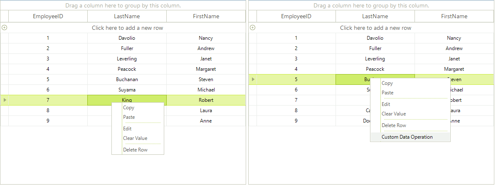

# Modifying the Default Context Menu

The default __RadGridView context__ menu can be customized in the ContextMenuOpening event handler.

## Removing an item from default RadGridView context menu:

In order to remove an item, you need to make a loop iterating the __e.ContextMenu.Items__ and check if the __e.ContextMenu.Items[index].Text__ is equal to the text of the menu item that you want to hide. If so, just set the __Visibility__ of the menu item to *Collapsed*:

<snippet id='gridview-modifingthedefaultcontextmenu-removecontextmenuitem-cs' />
<snippet id='gridview-modifingthedefaultcontextmenu-removecontextmenuitem-vb' />

>note If your grid is localized you can get the item text from the localization provider - `if (e.ContextMenu.Items[i].Text == RadGridLocalizationProvider.CurrentProvider.GetLocalizedString(RadGridStringId.ConditionalFormattingMenuItem))'

## Adding menu items to the default RadGridView context menu

In order to add custom menu items to the default context menu, *you should create menu item instances in the ContextMenuOpening event handler* and add them to the __e.ContextMenu.Items:__

<snippet id='gridview-modifingthedefaultcontextmenu-addcontextmenuoption-cs' />
<snippet id='gridview-modifingthedefaultcontextmenu-addcontextmenuoption-vb' />

>note You can subscribe to the **Click** event of the newly added menu items and thus execute the desired action when a **RadMenuItem** is clicked.


## Changing the Size of a Context Menu Item

The items in the default **RadGridView** context menu are **RadMenuItem** instances hosted by a **RadDropDownMenu**. To change an item's width or height, find the item in the **ContextMenuOpening** event handler, set **AutoSize** to *false*, and assign the desired **Size**.

The following example sets the size of the **Delete Row** item. Replace the item text with the text of the menu item that you want to customize.

````C#
using System.Drawing;

private void RadGridView1_ContextMenuOpening(object sender, ContextMenuOpeningEventArgs e)
{
	for (int i = 0; i < e.ContextMenu.Items.Count; i++)
	{
		RadMenuItem menuItem = e.ContextMenu.Items[i] as RadMenuItem;
		if (menuItem != null && menuItem.Text == "Delete Row")
		{
			menuItem.AutoSize = false;
			menuItem.Size = new Size(200, 40);
			break;
		}
	}
}
````

````VB.NET
Imports System.Drawing

Private Sub RadGridView1_ContextMenuOpening(sender As Object, e As ContextMenuOpeningEventArgs)
	For i As Integer = 0 To e.ContextMenu.Items.Count - 1
		Dim menuItem As RadMenuItem = TryCast(e.ContextMenu.Items(i), RadMenuItem)
		If menuItem IsNot Nothing AndAlso menuItem.Text = "Delete Row" Then
			menuItem.AutoSize = False
			menuItem.Size = New Size(200, 40)
			Exit For
		End If
	Next
End Sub
````

Set **AutoSize** to *false* before assigning **Size** so the item keeps the specified dimensions. Apply the setting in the **ContextMenuOpening** event so it is applied whenever the default context menu is displayed.


The result of combining the approaches from this article is shown on the screenshot below:



## See Also

* [Conditional Custom Context Menus]()
* [Custom Context Menus]()

