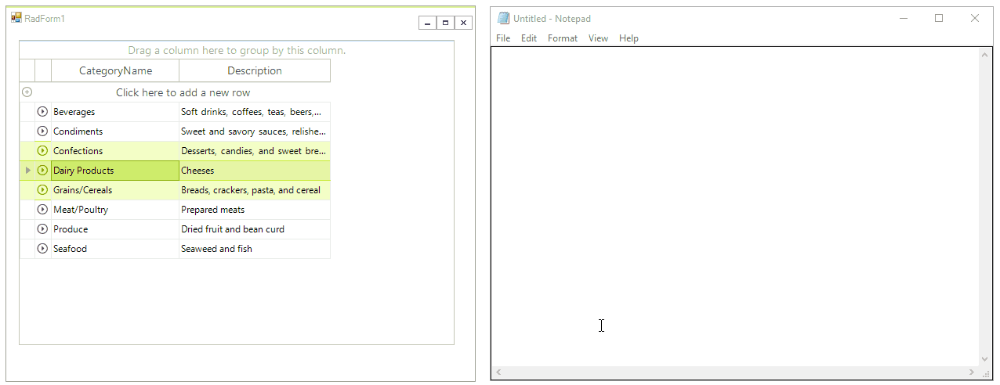
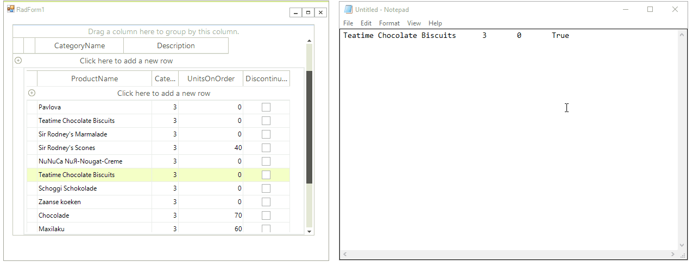

# Copy/Paste/Cut

__RadGridView__ supports built-in Copy/Paste functionality, which allows you to store text  in the Clipboard and then paste it in a different location. Using "Copy" and "Paste" gets quite useful when you want to enter the same content repeatedly.

## Copying

The copying functionality in __RadGridView__ is controlled via the __ClipboardCopyMode__ property. It has three possible values:
        
* __Disable:__ Copying will not be permitted.

* __EnableWithoutHeaderText:__ Will copy the cells content, skipping any header cells data.

* __EnableAlwaysIncludeHeaderText__ will copy the cells content including the header cells data.

Copying is a pretty simple operation. After cell/row is selected, right click over the data cell/row opens a context menu where the copy option exists. After selecting it, you can paste the content anywhere you need to (in Notepad or Excel for example).

>important Since **R1 2017** when you press `Ctrl+C` **RadGridView** copies the selected data considering the **SelectionMode**. If the **SelectionMode** property is set to *FullRowSelect*, pressing `Ctrl+C` will copy the entire row. If it is set to *CellSelect* only the selected cell will be copied when pressing `Ctrl+C`. Note that you can still copy just a single cell when the **SelectionMode** is set to *FullRowSelect*. It is necessary to select the desired cell and right click to open the context menu where you have "Copy" option.

>caption Figure 1: Copy Rows From RadGridView



__RadGridView__ introduces __Copying__ event which occurs when the grid has prepared appropriate data formats that represent the copy selection. This event is fired once for each supported format:*Text*, *HTML*, *CommaSeparatedValue*. You can cancel this event if the data is not allowed to be stored to Clipboard in a specific format, e.g. HTML format:

{{source=..\SamplesCS\GridView\CopyPasteBehavior\CopyPasteForm.cs region=Copying}} 
{{source=..\SamplesVB\GridView\CopyPasteBehavior\CopyPasteForm.vb region=Copying}} 

````C#
private void radGridView1_Copying(object sender, GridViewClipboardEventArgs e)
{
    if (e.Format == DataFormats.Html)
    {
        e.Cancel = true;
    }
}

````
````VB.NET
Private Sub radGridView1_Copying(sender As Object, e As GridViewClipboardEventArgs)
    If e.Format = DataFormats.Html Then
        e.Cancel = True
    End If
End Sub

````

{{endregion}} 


>note Additionally, you can use the __RadGridView__.__Copy__ method in order to perform programmatically copy functionality.
>

### The CopyingCellClipboardContent event

The __CopyingCellClipboardContent__ event is fired before each cell is copied. It allows you to easily change the copied values. The bellow example demonstrates how you can format the value in a particular cell before it is copied:

#### Copy only the time from a DateTime value.

{{source=..\SamplesCS\GridView\CopyPasteBehavior\CopyPasteForm.cs region=CopyEvent}} 
{{source=..\SamplesVB\GridView\CopyPasteBehavior\CopyPasteForm.vb region=CopyEvent}}
````C#
private void RadGridView1_CopyingCellClipboardContent(object sender, GridViewCellValueEventArgs e)
{
    if (e.Value is DateTime)
    {
        var value = (DateTime)e.Value;
        e.Value = value.ToShortTimeString();
    }
}

````
````VB.NET
Private Sub RadGridView1_CopyingCellClipboardContent(ByVal sender As Object, ByVal e As GridViewCellValueEventArgs)
    If TypeOf e.Value Is Date Then
        Dim value = CDate(e.Value)
        e.Value = value.ToShortTimeString()
    End If
End Sub

```` 

{{endregion}} 


## Pasting

The pasting functionality in __RadGridView__ is controlled via the __ClipboardPasteMode__ property. It has three possible modes:

* __Disable:__ Pasting is disabled.

* __Enable:__  Pasting is enabled

* __EnableWithNotifications:__ Pasting is enabled, and the respective cell events will be triggered upon paste operation.

The default context menu for data cells offers paste possibility, except when the __RadGridView__ is read-only, disabled or the __ClipboardPasteMode__ property is set to GridViewClipboardPasteMode.*Disable*.

>caption Figure 2: Paste rows to RadGridView



RadGridView.__Pasting__ event is appropriate for modifying the Clipboard data before pasting it in the grid.

The following example demonstrates how to capitalize the copied string before inserting it in the grid:

{{source=..\SamplesCS\GridView\CopyPasteBehavior\CopyPasteForm.cs region=Pasting}} 
{{source=..\SamplesVB\GridView\CopyPasteBehavior\CopyPasteForm.vb region=Pasting}} 

````C#
private void radGridView1_Pasting(object sender, GridViewClipboardEventArgs e)
{
    if (Clipboard.ContainsData(DataFormats.Text))
    {
        string data = Clipboard.GetData(DataFormats.Text).ToString();
        if (data != string.Empty)
        {
            Clipboard.SetData(DataFormats.Text, data.ToUpper());
        }
    }
}

````
````VB.NET
Private Sub radGridView1_Pasting(sender As Object, e As GridViewClipboardEventArgs)
    If Clipboard.ContainsData(DataFormats.Text) Then
        Dim data As String = Clipboard.GetData(DataFormats.Text).ToString()
        If data <> String.Empty Then
            Clipboard.SetData(DataFormats.Text, data.ToUpper())
        End If
    End If
End Sub

````

{{endregion}} 

You can cancel this event as well in order to prevent pasting data in some cases.

>note Additionally, you can use the __RadGridView__.__Paste__ method in order to perform programmatically paste functionality.
>

### PastingCellClipboardContent event

This event will be fired before the data is pasted in each cell. It allows you change or validate the data before the pasting operation is completed. The following example shows how you can show a message when invalid data is pasted.

#### Check the values when pasting

{{source=..\SamplesCS\GridView\CopyPasteBehavior\CopyPasteForm.cs region=PasteEvent}} 
{{source=..\SamplesVB\GridView\CopyPasteBehavior\CopyPasteForm.vb region=PasteEvent}}
````C#
private void RadGridView1_PastingCellClipboardContent(object sender, GridViewCellValueEventArgs e)
{
    if (e.Column.Name == "Date")
    {
        DateTime date;
        var valid = DateTime.TryParse(e.Value.ToString(), out date);
        if (!valid)
        {
            RadMessageBox.Show("Invalid Date format pasted in the Date column");
            e.Value = DateTime.Now;
        }
    }
}

````
````VB.NET
Private Sub RadGridView1_PastingCellClipboardContent(ByVal sender As Object, ByVal e As GridViewCellValueEventArgs)
    If e.Column.Name = "Date" Then
        Dim [date] As Date = Nothing
        Dim valid = Date.TryParse(e.Value.ToString(), [date])
        If Not valid Then
            RadMessageBox.Show("Invalid Date format pasted in the Date column")
            e.Value = Date.Now
        End If
    End If
End Sub

```` 


{{endregion}} 

## Key Combinations

*Ctrl+C* and *Ctrl+V* are the keys combinations, replacing Copy and Paste behavior. If the RadGridView.__MultiSelect__ property is set to *true*, it is possible to select all the cells by pressing *Ctrl+A*. Afterwards, pressing *Ctrl+C* will copy all the cells’ content and it is ready to be pasted.

## Cutting

The cutting functionality in __RadGridView__ is controlled via the __ClipboardCutMode__ property. It has three possible values:

* *Disable* – cutting will not be permitted

* *EnableWithoutHeaderText* – will cut the cells content, skipping any header cells data

* *EnableAlwaysIncludeHeaderText* – will cut the cells content including the header cells data

*Ctrl+X* is the key combination, replacing Cut behavior.

>note Additionally, you can use the __RadGridView__.__Cut__ method in order to perform programmatically cut functionality.
>

# See Also

* [Getting Started]()

* [Overview]()

* [How to Deal with Invalid FORMATETC structure Error when Copying Data from RadGridView]()

